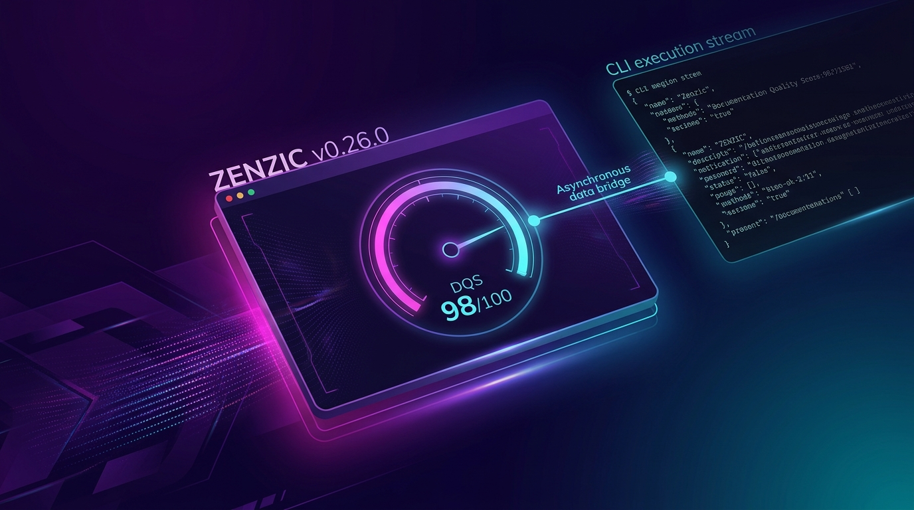

<!-- SPDX-FileCopyrightText: 2026 PythonWoods <dev@pythonwoods.dev> -->
<!-- SPDX-License-Identifier: Apache-2.0 -->

Zenzic v0.26.0 introduces the **Asynchronous CLI Execution Bridge**, bringing the global Documentation Quality Score (DQS) into the editor authoring environment while enforcing 100% mathematical determinism between terminal runs and VS Code status bar indicators.



<!-- more -->

## Reconciling Editor Performance with Global Scoring

Calculating a workspace-wide Documentation Quality Score across hundreds of Markdown files requires a complete topological audit. In previous iterations, attempting to estimate global quality from incremental Language Server Protocol (LSP) events led to diagnostic divergence between in-editor status bar indicators and authoritative CI/CD batch runs.

Zenzic v0.26.0 solves this fundamental architectural challenge by establishing a strict separation of concerns:

- **Ultra-Fast LSP Engine (sub-50ms)**: The Python Language Server remains purely focused on incremental single-file diagnostics and real-time buffer validation.
- **Asynchronous CLI Execution Bridge**: The VS Code extension acts as an orchestrator, executing `zenzic score --json` in a background worker process via `child_process.execFile`.

---

## Architectural Invariants Preserved

### 1. Absolute Determinism
Because the status bar indicator is powered directly by `zenzic score --json`, the score displayed inside VS Code is **mathematically identical** to the score computed by GitHub Actions and CI/CD pipelines.

### 2. Radical Unawareness (ADR-075)
The Python Core remains completely unaware of its consumer. When invoked with `--json`, `zenzic score` writes a single, structured JSON payload to `stdout` and exits cleanly. It contains zero editor-specific or transport-specific logic.

### 3. Thin Client Architecture
The TypeScript extension performs no scoring calculations. It simply parses the JSON response and updates the status bar item (`$(dashboard) Zenzic DQS: 98/100`) and detailed breakdown tooltips.

---

## Programmatic Output: The `--json` Shorthand Flag

To support programmatic consumers, CLI tools, and editor integrations, Zenzic v0.26.0 introduces the `--json` shorthand flag on the `zenzic score` command.

```bash
# Programmatic JSON execution
zenzic score --json
```

### JSON Output Schema

```json
{
  "project": "zenzic",
  "score": 98,
  "threshold": 0,
  "status": "success",
  "timestamp": "2026-07-26T18:49:29+00:00",
  "categories": [
    {
      "name": "structural",
      "weight": 0.3,
      "issues": 0,
      "category_score": 1.0,
      "contribution": 0.3,
      "raw_penalty": 0,
      "is_capped": false
    },
    {
      "name": "navigation",
      "weight": 0.25,
      "issues": 0,
      "category_score": 1.0,
      "contribution": 0.25,
      "raw_penalty": 0,
      "is_capped": false
    },
    {
      "name": "content",
      "weight": 0.2,
      "issues": 0,
      "category_score": 1.0,
      "contribution": 0.2,
      "raw_penalty": 0,
      "is_capped": false
    },
    {
      "name": "brand",
      "weight": 0.25,
      "issues": 0,
      "category_score": 1.0,
      "contribution": 0.25,
      "raw_penalty": 0,
      "is_capped": false
    }
  ],
  "suppression_count": 2,
  "suppression_cap": 30,
  "suppression_debt_pts": 2,
  "debt_status": "MANAGED DEBT"
}
```

---

## In-Editor UX & Contributed Commands

Zenzic v0.26.0 contributes a new command to VS Code:

- **`Zenzic: Compute Global DQS` (`zenzic.computeDQS`)**: Clicking the DQS status bar item triggers an on-demand background evaluation.

### Status Bar Indicator States

- `$(dashboard) Zenzic DQS: 98/100` — High quality score ($\ge 80$).
- `$(warning) Zenzic DQS: 65/100` — Quality floor warning ($50 \le \text{score} < 80$).
- `$(error) Zenzic DQS: 30/100` — Blocking quality failure ($\text{score} < 50$).
- `$(sync~spin) Zenzic DQS: Computing...` — Background evaluation active.

---

## Upgrade Guide

### Core Engine & CLI
```bash
uv tool install --force zenzic
```

### VS Code Extension
Update to version `0.26.0` from the VS Code Marketplace or reload your editor workspace.
