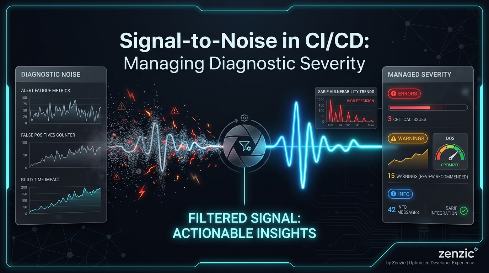

<!-- SPDX-FileCopyrightText: 2026 PythonWoods <dev@pythonwoods.dev> -->
<!-- SPDX-License-Identifier: Apache-2.0 -->



A static analyzer is only as useful as its signal-to-noise ratio.

If a tool floods a CI/CD pipeline with hundreds of low-value notices, developers eventually stop paying attention. The result is predictable: triage becomes slower, dashboards become cluttered, and governance loses credibility.

This problem is not unique to documentation analysis. It exists across compilers, linters, security scanners, and code quality platforms. The challenge is always the same: surface actionable findings without overwhelming engineers with noise.

In Zenzic, documentation is treated as production code. The diagnostic engine therefore follows a strict severity taxonomy designed to separate enforcement from observability and ensure that every finding has a clear operational meaning.

<!-- more -->

## The Severity Taxonomy

Every finding emitted by Zenzic is represented as a `RuleFinding` and carries an intrinsic severity level.

The engine classifies findings into three categories:

### Errors (Build Blockers)

Errors represent structural failures, security violations, or conditions that make the repository unsafe to publish.

Examples include:

- `Z101` — Broken Link
- `Z201` — Credential Leak
- `Z616` — Cross-Namespace Link Forbidden

Errors are enforcement mechanisms.

When an error is detected, the build fails and Zenzic returns a non-zero exit code.

Depending on the category of the failure, the engine may return different exit codes to distinguish structural failures from security violations.

An error is not advisory. It represents a condition that requires remediation before publication.

### Warnings (Quality Degraders)

Warnings indicate that content remains structurally valid but violates governance rules, style requirements, or repository standards.

Examples include:

- `Z511` — Excessive Sentence Length
- `Z610` — Missing Required Frontmatter

Warnings do not fail the build by default.

Instead, they contribute negatively to the repository's Document Quality Score (DQS), allowing teams to measure quality drift without immediately blocking delivery.

Warnings exist to make quality visible.

They are governance signals, not enforcement signals.

### Info (Architectural Notices)

Info findings describe observable repository conditions that are not defects.

Examples include:

- `Z106` — Circular Link
- `Z401` — Missing Directory Index

These findings may be useful for architecture analysis, navigation audits, or repository introspection, but they do not indicate broken behavior.

Info findings:

- Never fail the build.
- Never affect the DQS.
- Are hidden from CLI output by default.

They can be displayed explicitly:

```bash
zenzic check all --show-info
```

The default behavior keeps terminal output focused on actionable findings.

---

## Why Severity Exists

Many tools treat severity as a cosmetic label.

In practice, severity determines operational behavior.

A finding classified as an Error affects enforcement.

A finding classified as a Warning affects governance.

A finding classified as Info affects observability.

Collapsing these concepts into a single stream of diagnostics produces confusion and eventually creates alert fatigue.

For a diagnostic engine to remain trustworthy, every severity level must have a clearly defined consequence.

---

## The `--strict` Gate

As repositories mature, organizations often decide that governance violations should be treated as release blockers.

Zenzic supports this through the `--strict` execution mode.

```bash
zenzic check all --strict
```

When strict mode is enabled:

- Errors remain Errors.
- Warnings are promoted to Errors.
- Info findings remain Info.

This distinction is intentional.

Promoting every informational notice into a build blocker would punish valid architectural patterns and create unnecessary friction.

Consider a documentation system where a glossary page links to a CLI reference page and the CLI reference page links back to the glossary.

This creates a circular relationship that may be entirely intentional.

Treating such a pattern as a build failure would reduce trust in the engine rather than improve quality.

Strict mode therefore applies enforcement only to findings that represent actionable governance concerns.

---

## GitHub Code Scanning and SARIF

Severity becomes particularly important when integrating with enterprise tooling.

When executed inside GitHub Actions, Zenzic exports findings using the SARIF v2.1.0 standard.

The formatter maps Zenzic severities directly to SARIF levels:

| Zenzic | SARIF |
|----------|----------|
| Error | error |
| Warning | warning |
| Info | note |

This mapping allows GitHub Code Scanning to display findings using native severity indicators while preserving the semantics defined by the engine.

The result is a consistent experience across:

- Local CLI execution
- GitHub Actions
- Pull Request reviews
- Security dashboards
- Compliance reporting

---

## The Observability Problem

A failed build remains a failed build.

If Zenzic emits a `Z201` Credential Leak as an Error, the CI pipeline fails immediately and the issue cannot pass through a properly configured quality gate.

The problem is not enforcement.

The problem is observability.

GitHub Code Scanning imports every result present in the SARIF payload.

Informational findings are displayed as SARIF notes.

If a repository intentionally contains hundreds of architectural patterns that generate informational diagnostics, those findings still consume attention, screen space, and review capacity.

An engineer reviewing a pull request should not need to navigate hundreds of accepted notices before identifying the handful of findings that actually require action.

Noise does not bypass governance.

Noise increases triage cost.

Noise slows remediation.

Noise reduces trust in diagnostic systems.

Over time, excessive informational output trains developers to ignore entire categories of findings, even when those findings were originally intended to improve visibility.

This is the operational definition of alert fatigue.

---

## The Zero-DBT Solution: Declarative Suppression

Zenzic follows a Zero-DBT (Zero Documented Technical Debt) philosophy.

Under this model, intentional patterns should be declared explicitly rather than emitted continuously as findings that everyone already understands and ignores.

If circular links are an accepted architectural decision within a repository, they should be suppressed at the source.

For example:

```toml
[governance.directory_policies]
"docs/**" = ["Z106"]
```

This configuration tells the engine that circular links are expected within the selected scope.

As a result:

- The finding is not computed.
- The finding is not emitted.
- The finding is not displayed in the CLI.
- The finding is not exported to SARIF.
- The finding does not appear in GitHub Code Scanning.

The outcome is deterministic:

- Cleaner terminal output.
- Smaller SARIF payloads.
- Faster triage.
- Simpler pull request reviews.
- Higher signal-to-noise ratio.

The most effective informational finding is often the one that never needs to be generated.

---

## Severity as Governance

Diagnostic severity is not a presentation detail.

It is a governance mechanism.

Errors enforce repository correctness.

Warnings measure quality drift.

Info findings provide optional architectural visibility.

When these categories are kept separate, CI/CD systems remain predictable and trustworthy.

When they are mixed together, signal is diluted by noise and developers lose confidence in the tooling.

A deterministic engine must provide deterministic observability.

By enforcing a strict severity taxonomy, supporting configurable escalation through strict mode, and enabling declarative suppression of accepted patterns, Zenzic ensures that CI/CD pipelines remain focused on actionable outcomes rather than diagnostic clutter.

The objective is simple:

**Surface what matters.**

**Suppress what does not.**

**Preserve trust in the signal.**

---

### System Vectors

Zenzic is open-source (Apache 2.0) and operates with zero configuration out of the box.

Test the engine against your current repository without installing dependencies:

```bash
uvx zenzic check all
```

- **Source Code & Architecture**: <https://github.com/PythonWoods/zenzic>
- **Official Documentation**: <https://zenzic.dev>
- **VS Code Extension**: <https://marketplace.visualstudio.com/items?itemName=PythonWoods.zenzic-vscode>
