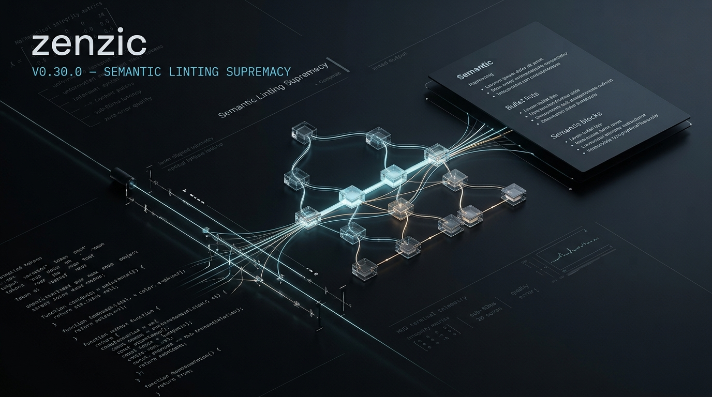

<!-- SPDX-FileCopyrightText: 2026 PythonWoods <dev@pythonwoods.dev> -->
<!-- SPDX-License-Identifier: Apache-2.0 -->



Zenzic v0.30.0 delivers the **Semantic Linting Supremacy** milestone. This major update extends Zenzic beyond link verification and metadata validation, establishing a unified, deterministic engine for semantic AST analysis, structural accessibility, editorial style governance, and atomic auto-remediation.

<!-- more -->

## Beyond Link Validation: The Need for Semantic Precision

Traditional prose linters rely on heavy runtime dependencies, complex grammar engines, or probabilistic heuristics. While these tools attempt to catch readability issues, they often suffer from significant downsides:

- **Slow Performance**: Multi-second execution times that cannot sustain sub-50ms Language Server Protocol (LSP) feedback loops during live editing.
- **Flaky Auto-Fixes**: Destructive string replacements that corrupt surrounding Markdown structure, code fences, and frontmatter.
- **Subprocess Overhead**: Invoking external toolchains in CI/CD pipelines, introducing fragile environment setups.

Zenzic v0.30.0 solves this by embedding semantic, structural, and editorial style evaluation directly into its native Abstract Syntax Tree (AST) engine. Operating under strict pure-function principles and Google RE2 non-backtracking regular expressions, Zenzic delivers instant diagnostic feedback without external runtimes or non-deterministic behavior.

---

## Native Semantic and Accessibility Rules

Semantic correctness ensures that Markdown documentation renders consistently across static site generators and accessible screen readers. Zenzic v0.30.0 introduces six built-in semantic rules:

### Duplicate Headings and Anchor Collision (Z513)

When documents contain duplicate heading titles, static site generators produce ambiguous or numbered anchor slugs (such as `#setup-guide_1`). [`Z513`](../../rules/Z513.md) scans the AST for identical heading texts across the file, enforcing clear, unambiguous section anchors.

### Generic Image Alt Text (Z514)

Accessibility is essential for technical documentation. [`Z514`](../../rules/Z514.md) inspects both Markdown images (``) and raw HTML `` elements to flag generic placeholder text such as "image", "screenshot", or "diagram", guiding authors to provide descriptive alternative text.

### Bare URLs in Prose (Z515)

Unformatted URLs (e.g., `https://example.com` in plain text) break semantic parsing across various Markdown engines. [`Z515`](../../rules/Z515.md) detects bare URLs and supports automated remediation via the Atomic Mutator, wrapping them into standard `<url>` syntax.

### Multiple H1 Headings (Z516)

Semantic HTML mandates a single `<h1>` element per document to maintain a predictable document hierarchy. [`Z516`](../../rules/Z516.md) flags documents with more than one top-level heading as a structural error.

### Heading Punctuation (Z517)

Headings ending with trailing periods, colons, or semicolons degrade visual typography. [`Z517`](../../rules/Z517.md) flags invalid trailing punctuation while preserving inline code tags and custom anchor identifiers (`{#custom-id}`).

### Semantic List Heuristics (Z520)

When authors write lists formatted with newlines and semicolons or commas without Markdown bullet markers (`- `, `* `), Markdown engines render them as unbroken prose paragraphs rather than semantic HTML `<ul>` elements. [`Z520`](../../rules/Z520.md) detects these pseudo-lists and transforms them into valid bulleted lists.

---

## Editorial Style and Prose Quality

Technical organizations need consistent editorial tone without sacrificing build performance. Zenzic v0.30.0 introduces opt-in prose quality checks configured directly under the `[policies]` table:

```toml
[policies]
enable_passive_voice_check = true
weasel_words = ["clearly", "simply", "obviously", "basically", "very"]
```

- **Passive Voice Detection ([`Z518`](../../rules/Z518.md))**: Highlights passive constructions (e.g., "was created by the engine") using deterministic RE2 heuristics, encouraging active and authoritative technical writing.
- **Weasel Word Eradication ([`Z519`](../../rules/Z519.md))**: Identifies vague or softening words that weaken documentation rigor.

---

## Declarative Policy-as-Code Governance

To maintain organizational standards across distributed documentation repositories, v0.30.0 expands declarative governance:

```toml
[policies]
forbidden_content_patterns = ["(?i)\\bconfidential\\b", "(?i)\\binternal only\\b"]
required_heading_patterns = ["^Overview$", "^Troubleshooting$"]
max_document_complexity = 45
```

- **Forbidden Content Patterns ([`Z617`](../../rules/Z617.md))**: Flags proprietary terms, deprecated naming, or forbidden keywords in documentation prose.
- **Required Heading Patterns ([`Z618`](../../rules/Z618.md))**: Enforces standard document templates across pages (e.g., requiring an "Overview" section in all guides).
- **Document Cognitive Complexity ([`Z619`](../../rules/Z619.md))**: Calculates a deterministic complexity score based on word count, heading depth, and link density, preventing oversized, unmaintainable pages.

---

## The Power of the Atomic Mutator

Diagnostic detection is only half the solution; automated remediation completes the developer experience.

Zenzic v0.30.0 expands the **Atomic Mutator** (`src/zenzic/core/mutator.py`). Auto-fix transformations are guaranteed to be idempotent and lossless:

```bash
# Preview automated fixes without writing to disk
zenzic fix --dry-run

# Atomically apply fixes across the entire repository
zenzic fix --apply
```

Supported auto-fix rules in v0.30.0 include:

| Rule Code | Description | Automated Transformation |
| :--- | :--- | :--- |
| `Z108` | Empty Link Text | Injects placeholder text |
| `Z505` | Untagged Code Block | Injects default `text` language tag |
| `Z515` | Bare URL Used | Wraps raw URLs in `<url>` syntax |
| `Z517` | Heading Punctuation | Strips trailing `.`, `:`, `;` from headings |
| `Z520` | Malformed List Detected | Prefixes list lines with `- ` |
| `Z603` | Dead Suppression | Removes obsolete suppression comments |

All automated fixes are shared identically between the CLI tool and the VS Code LSP extension, ensuring 100% remediation parity across environments.

---

## Looking Ahead: The Adapter Ecosystem

With the completion of v0.30.0, Zenzic has solidified its foundation as the fastest, most deterministic document integrity and quality engine for Markdown graphs.

In our upcoming **v0.31.0** milestone, we will begin the concrete rollout of the Adapter Ecosystem, starting with `@zenzic/plugin-docusaurus` to validate artifact-based routing for JavaScript-centric documentation frameworks, alongside a comprehensive auto-fix expansion audit.

Explore the complete [Finding Codes Reference](../../reference/finding-codes.md) and get started today with:

```bash
pip install --upgrade zenzic
zenzic check all --strict
```
