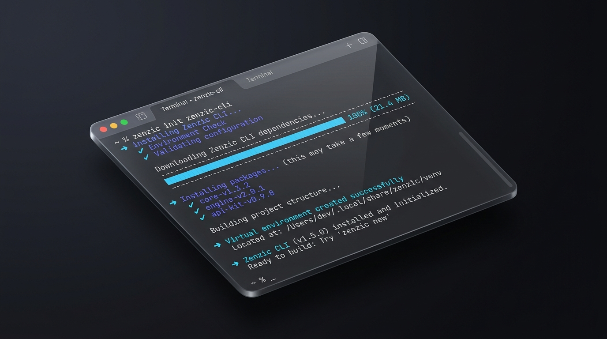
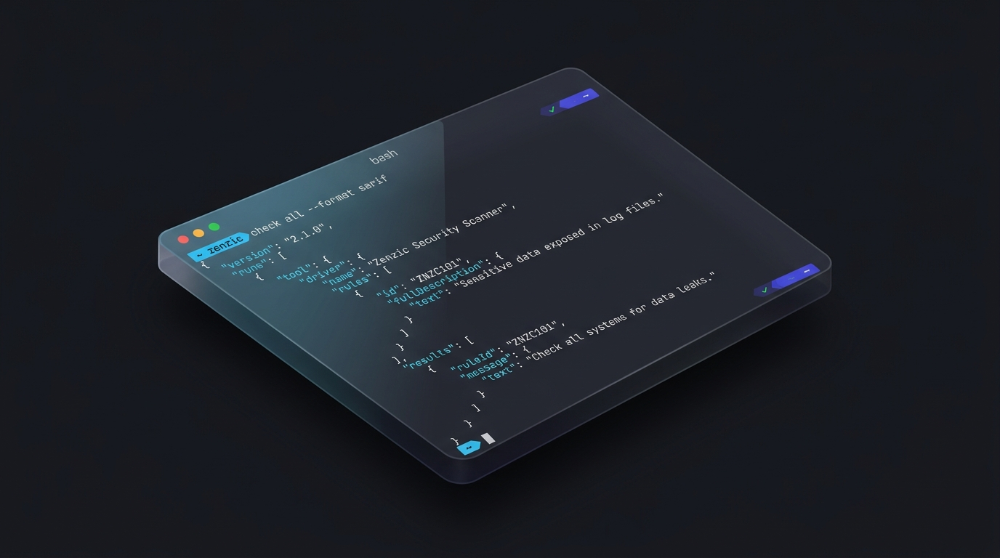

<!-- SPDX-FileCopyrightText: 2026 PythonWoods <dev@pythonwoods.dev> -->
<!-- SPDX-License-Identifier: Apache-2.0 -->


Zenzic v0.30.0 is a dual milestone. On the **engine side**, it delivers the **Semantic Linting Supremacy** update: native AST-based semantic analysis, structural accessibility rules, editorial style governance, and atomic auto-remediation — the complete picture of what deterministic documentation quality looks like at the AST level. On the **adoption side**, it delivers **Frictionless Adoption**: the VS Code extension can now provision its own engine automatically, removing the last remaining manual setup step for every developer who opens a Markdown file.

Together, these two pillars define what v0.30.0 is about: *making the highest standard of documentation quality accessible to every developer on your team, regardless of their Python expertise or system configuration.*

<!-- more -->

## Beyond Link Validation: The Need for Semantic Precision

Traditional prose linters rely on heavy runtime dependencies, complex grammar engines, or probabilistic heuristics. While these tools attempt to catch readability issues, they often suffer from significant downsides:

- **Slow Performance**: Multi-second execution times that cannot sustain sub-50ms Language Server Protocol (LSP) feedback loops during live editing.
- **Flaky Auto-Fixes**: Destructive string replacements that corrupt surrounding Markdown structure, code fences, and frontmatter.
- **Subprocess Overhead**: Invoking external toolchains in CI/CD pipelines, introducing fragile environment setups.

Zenzic v0.30.0 solves this by embedding semantic, structural, and editorial style evaluation directly into its native Abstract Syntax Tree (AST) engine. Operating under strict pure-function principles and Google RE2 non-backtracking regular expressions, Zenzic delivers instant diagnostic feedback without external runtimes or non-deterministic behavior.

---

## Native Semantic and Accessibility Rules

Semantic correctness ensures that Markdown documentation renders consistently across static site generators and accessible screen readers. Zenzic v0.30.0 introduces six built-in semantic rules:

### Duplicate Headings and Anchor Collision (Z513)

When documents contain duplicate heading titles, static site generators produce ambiguous or numbered anchor slugs (such as `#setup-guide_1`). [`Z513`](../../rules/Z513.md) scans the AST for identical heading texts across the file, enforcing clear, unambiguous section anchors.

### Generic Image Alt Text (Z514)

Accessibility is essential for technical documentation. [`Z514`](../../rules/Z514.md) inspects both Markdown images (``) and raw HTML `` elements to flag generic placeholder text such as "image", "screenshot", or "diagram", guiding authors to provide descriptive alternative text.

### Bare URLs in Prose (Z515)

Unformatted URLs (e.g., `https://example.com` in plain text) break semantic parsing across various Markdown engines. [`Z515`](../../rules/Z515.md) detects bare URLs and supports automated remediation via the Atomic Mutator, wrapping them into standard `<url>` syntax.

### Multiple H1 Headings (Z516)

Semantic HTML mandates a single `<h1>` element per document to maintain a predictable document hierarchy. [`Z516`](../../rules/Z516.md) flags documents with more than one top-level heading as a structural error.

### Heading Punctuation (Z517)

Headings ending with trailing periods, colons, or semicolons degrade visual typography. [`Z517`](../../rules/Z517.md) flags invalid trailing punctuation while preserving inline code tags and custom anchor identifiers (`{#custom-id}`).

### Semantic List Heuristics (Z520)

When authors write lists formatted with newlines and semicolons or commas without Markdown bullet markers (`-`, `*`), Markdown engines render them as unbroken prose paragraphs rather than semantic HTML `<ul>` elements. [`Z520`](../../rules/Z520.md) detects these pseudo-lists and transforms them into valid bulleted lists.

---

## Editorial Style and Prose Quality

Technical organizations need consistent editorial tone without sacrificing build performance. Zenzic v0.30.0 introduces opt-in prose quality checks configured directly under the `[policies]` table:

```toml
[policies]
enable_passive_voice_check = true
weasel_words = ["clearly", "simply", "obviously", "basically", "very"]
```

- **Passive Voice Detection ([`Z518`](../../rules/Z518.md))**: Highlights passive constructions (e.g., "was created by the engine") using deterministic RE2 heuristics, encouraging active and authoritative technical writing.
- **Weasel Word Eradication ([`Z519`](../../rules/Z519.md))**: Identifies vague or softening words that weaken documentation rigor.

---

## Declarative Policy-as-Code Governance

To maintain organizational standards across distributed documentation repositories, v0.30.0 expands declarative governance:

```toml
[policies]
forbidden_content_patterns = ["(?i)\\bconfidential\\b", "(?i)\\binternal only\\b"]
required_heading_patterns = ["^Overview$", "^Troubleshooting$"]
max_document_complexity = 45
```

- **Forbidden Content Patterns ([`Z617`](../../rules/Z617.md))**: Flags proprietary terms, deprecated naming, or forbidden keywords in documentation prose.
- **Required Heading Patterns ([`Z618`](../../rules/Z618.md))**: Enforces standard document templates across pages (e.g., requiring an "Overview" section in all guides).
- **Document Cognitive Complexity ([`Z619`](../../rules/Z619.md))**: Calculates a deterministic complexity score based on word count, heading depth, and link density, preventing oversized, unmaintainable pages.

---

## The Power of the Atomic Mutator

Diagnostic detection is only half the solution; automated remediation completes the developer experience.

Zenzic v0.30.0 expands the **Atomic Mutator** (`src/zenzic/core/mutator.py`). Auto-fix transformations are guaranteed to be idempotent and lossless:

```bash
# Preview automated fixes without writing to disk
zenzic fix --dry-run

# Atomically apply fixes across the entire repository
zenzic fix --apply
```

Supported auto-fix rules in v0.30.0 include:

| Rule Code | Description | Automated Transformation |
| :--- | :--- | :--- |
| `Z108` | Empty Link Text | Injects placeholder text |
| `Z505` | Untagged Code Block | Injects default `text` language tag |
| `Z515` | Bare URL Used | Wraps raw URLs in `<url>` syntax |
| `Z517` | Heading Punctuation | Strips trailing `.`, `:`, `;` from headings |
| `Z520` | Malformed List Detected | Prefixes list lines with `-` |
| `Z603` | Dead Suppression | Removes obsolete suppression comments |

All automated fixes are shared identically between the CLI tool and the VS Code LSP extension, ensuring 100% remediation parity across environments.

---

## Zero-Config Developer Experience

v0.30.0 introduces the most impactful adoption improvement in Zenzic's history: **you no longer need to install Python or configure a binary path to use the VS Code extension**.

Previously, the VS Code extension required users to have the `zenzic` Python CLI already installed on their machine — a step that introduced friction for developers unfamiliar with Python toolchains. Starting with this release, the extension's Auto-Provisioning Engine removes that barrier entirely.



### How it works

When the extension activates and cannot find a `zenzic` binary, it shows a single consent notification:

> *"Zenzic CLI not found. Install it automatically in an isolated environment? (No changes will be made to your system Python, PATH, or shell config.)"*

Click **Install**, and the Auto-Provisioning Engine takes over:

1. **Detection** — checks configured path, system `$PATH`, and known binary locations (`~/.local/bin`, `~/.cargo/bin`, `~/.uv/bin`).
2. **Isolation** — creates a dedicated virtual environment inside VS Code's own global storage directory. Your system Python and `$PATH` are never touched.
3. **Installation** — uses `uv` for a hermetic, millisecond-fast install if available; falls back to `python3 -m venv` + `pip` on systems without `uv`.
4. **Verification** — confirms the installed binary meets the minimum version requirement (`>= 0.30.0`) before starting the Language Server.
5. **Persistence** — stores the binary path in VS Code `globalState` so subsequent extension activations are instant — no re-installation, no re-prompting.

For teams with corporate proxies or strict package management policies, a single settings entry disables the engine: `"zenzic.autoProvision": false`.

### The philosophy behind Zero-Config

The Thin Client Architecture (ADR-075) was always designed to keep the extension lightweight and the Python Core sovereign. Auto-provisioning is the natural completion of that vision: the extension now manages the *acquisition* of its engine, while still delegating 100% of document analysis to the Python binary. No parsing logic crossed the TypeScript/Python boundary. No architectural invariants were compromised.

---

## CI/CD Integration: From Code Review to Deployment Gate

For teams enforcing documentation quality in GitHub Actions, Zenzic's SARIF integration turns findings into native GitHub PR annotations:



```yaml
- uses: PythonWoods/zenzic-action@v2
  with:
    format: sarif
    upload-sarif: "true"
```

Findings from Z513 (duplicate anchors), Z516 (multiple H1), and Z617 (forbidden content) appear as inline code scanning alerts in the GitHub security tab and as PR review annotations — the same deterministic diagnostics your team sees in VS Code, now enforced at merge time.

---

## Hybrid Adaptive Performance & Unix Philosophy

Documentation repositories grow rapidly. To maintain sub-second feedback across enterprise-scale doc sets, v0.30.0 incorporates the **Hybrid Adaptive Multiprocessing Engine**:

- **7x Parallel Speedup**: On repositories with $\ge 50$ documents, Zenzic automatically coordinates a `ProcessPoolExecutor` worker pool. Scanning hundreds of pages drops from multi-second compilations down to ~1.0 second.
- **Single-Pass AST Evaluation**: Analysis, link resolution, accessibility checks, and credential scanning execute in a single $O(N)$ pass without duplicate I/O or redundant tree traversals.
- **Silent-on-Success Unix Philosophy**: In pre-commit hooks and CI quality gates, passing `--quiet` (`-q`) and `--no-header` emits strictly **0 bytes** on success (Exit Code 0), keeping developer terminals and CI logs noise-free.

---

## v0.30.0 is just the beginning

With v0.30.0, Zenzic has solidified two pillars simultaneously: the deepest semantic analysis engine in the Markdown tooling ecosystem, and the most frictionless installation experience for VS Code users.

Every developer on your team — from the TypeScript engineer who has never touched Python, to the SRE who manages documentation pipelines — now has access to the same deterministic, security-first quality engine, with zero configuration overhead.

**Get started in 30 seconds:**

```bash
# CLI users
pip install --upgrade zenzic
zenzic check all --strict

# VS Code users
# Install the Zenzic extension — the engine provisions itself automatically.
```

Explore the complete [Finding Codes Reference](../../reference/finding-codes.md), the [VS Code Extension documentation](../../editor/vscode.md), and the [GitHub Action integration guide](../../how-to/configure-ci-cd.md) to deploy the full Zenzic quality platform across your team.
