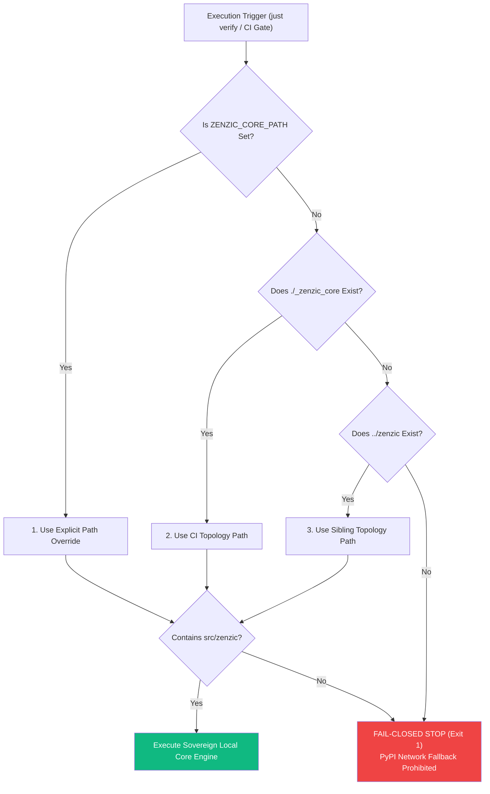

<!-- SPDX-FileCopyrightText: 2026 PythonWoods <dev@pythonwoods.dev> -->
<!-- SPDX-License-Identifier: Apache-2.0 -->

# Sovereign Verification Model & Zero-Network Parity

Local environment drift and unpinned network dependencies compromise software supply chain security. When local development suites and CI/CD pipelines use different resolution mechanisms or fetch floating dependencies from remote package indexes, quality gates lose determinism and security assurances fail.

Zenzic enforces the **Sovereign Verification Model**. This architecture contract mandates zero-network execution, fail-closed resolution topology, and 100% operational parity between local developer environments and CI/CD quality gates.

---

## Core Resolution Topology

The following diagram illustrates how Zenzic resolves the sovereign core engine path across local environments and CI pipelines:

---

## Core Architectural Invariants

`Zero-Network Execution`
: Quality gate verification strictly forbids fetching unverified packages or network binaries during execution. All dependencies are statically linked or pre-built.

`Sovereign Resolution Order`
: Core resolution follows an immutable 3-step hierarchy (`ZENZIC_CORE_PATH` → `./_zenzic_core` → `../zenzic`).

`Fail-Closed Stop`
: If no valid local core directory containing `src/zenzic` is located, verification halts immediately with a fatal error. Automatic PyPI fallback is strictly prohibited.

`Immutable SHA Pinning (ADR-089)`
: All GitHub Action workflows and submodules pin core dependencies by immutable commit SHA digest (`# x-zenzic-core-pin @ <sha>`), preventing supply chain tampering.

---

## Verification Layer Contracts

The Sovereign Verification Model distributes verification responsibilities across distinct operational layers:

| Layer | Entrypoint | Non-Negotiable Invariant |
| :--- | :--- | :--- |
| **Operator Layer** | `justfile` (`just verify`) | Executes sovereign resolution order; halts on fail-closed condition |
| **Automation Layer** | `noxfile.py` | Enforces isolated Python sessions using local core source tree |
| **CI Topology Layer** | `.github/workflows/*.yml` | Checks out `_zenzic_core` at target SHA before executing verification |
| **Release Contract** | `release-contracts` recipe | Rejects PyPI fallback patterns and unversioned floating tags |

---

## Anti-Drift Policy

The following practices are **strictly prohibited** in Zenzic quality gates:

- `uvx zenzic@...` remote network execution inside repository-internal quality gates.
- Ad-hoc local configuration edits used to bypass structural checks.
- Divergent execution scripts between local developer workstations and CI runners.

---

## See Also

- [Adapter API Reference](../reference/adapter-api.md)
