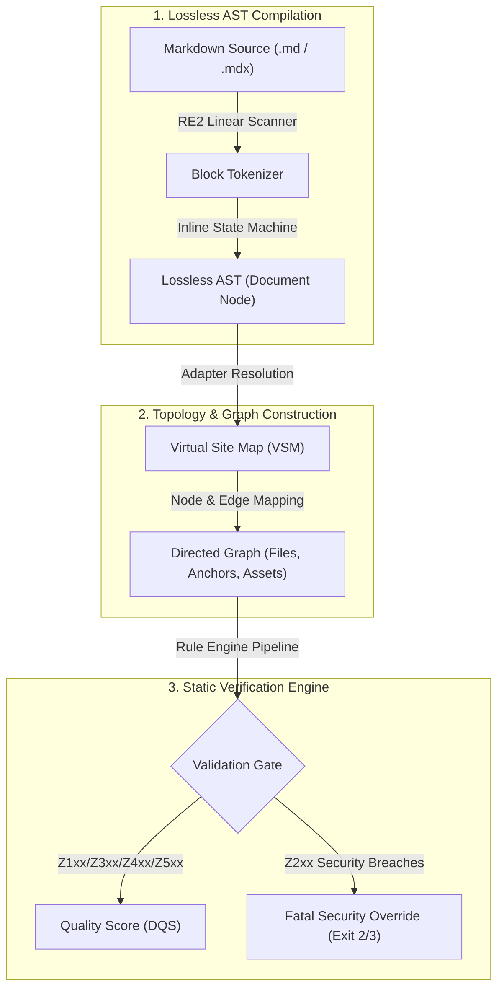

<!-- SPDX-FileCopyrightText: 2026 PythonWoods <dev@pythonwoods.dev> -->
<!-- SPDX-License-Identifier: Apache-2.0 -->

# AST Foundations & Topological Graph Engine

Text-based regex linters evaluate Markdown as unstructured strings of characters. They cannot resolve cross-file link graphs, validate heading anchor targets, or enforce structural contracts across multi-file repositories. As a consequence, documentation drift remains silent until a customer encounters broken navigation or an invalid reference in production.

Zenzic replaces text matching with a **Lossless Abstract Syntax Tree (AST) Compiler** and a **Virtual Site Map (VSM) Topological Graph Engine**. Zenzic compiles raw Markdown into structured syntax trees, computes a directed graph of all repository nodes and edges, and executes static security analysis in $O(N)$ deterministic time.

---

## Paradigm Shift: Linter vs. Topological Engine

-   :material-text-search:{ .lg .middle } **Unstructured Text Linter**

    ---

    - Treats Markdown as plain text regex lines
    - Cannot verify cross-file link targets or heading anchors
    - Fails to track directory indexes or navigation topology
    - Produces false positives and non-reproducible runs

-   :material-graph-outline:{ .lg .middle } **Zenzic Topological Graph Engine**

    ---

    - Compiles Lossless ASTs and computes a Directed Graph (VSM)
    - Verifies link targets, anchor references, and nav contracts statically
    - Enforces hard security boundaries (SAST credential scanner)
    - Delivers 100% bit-for-bit deterministic execution across platforms

---

## Architectural Pipeline

The following diagram illustrates how raw Markdown source files transition through the Lossless AST Compiler into the Virtual Site Map (VSM) Directed Graph for static verification:

---

## Core AST Architecture

The Zenzic AST enforces strict structural invariants and supports byte-for-byte lossless round-trip serialization.

### Base Contract

`Node`
: The fundamental tree element. Encapsulates position metadata and child node arrays.

`BlockNode`
: Represents block-level structural elements (`Document`, `Paragraph`, `Heading`).

`InlineNode`
: Represents inline formatting elements (`TextNode`, `LinkNode`, `CodeSpanNode`).

### Structural Node Contract

`Document`
: The root `BlockNode` containing all top-level document structures.

`Paragraph`
: A `BlockNode` aggregating `TextNode` objects. Blank lines evaluate to distinct `Paragraph` nodes to guarantee losslessness.

`Heading`
: A `BlockNode` containing exact `marker` (`#`), `level` (1–6), `prefix_space`, and text content required to reconstruct the exact source file.

### Inline Node Contract

`TextNode`
: Contains raw text strings.

`LinkNode`
: Represents Markdown links `[text](target)`. Contains a `polyglot_data` dictionary to capture raw HTML attributes and target anchor references.

`CodeSpanNode`
: Represents inline code `` `code` ``.

---

## Lossless Round-Trip Serialization Guarantee

The serialization function `zenzic.core.parser.serialize(node)` accepts any AST node and emits a string that is **strictly byte-for-byte identical** to the original input. This enables non-destructive mutations during automated auto-fix operations (`zenzic fix`).

---

## Non-Destructive Auto-Fix Engine

Zenzic implements an AST `Mutator` engine to execute precise, safe code modifications:

1. **The Mutation Protocol**: Developers implement `Mutation` classes (e.g. `EmptyLinkTextMutation`) containing an `apply(node)` method that modifies AST nodes in-place.
2. **Immutability Protection**: The `Mutator` engine operates on a `copy.deepcopy` of the original AST, preventing unintended side effects.
3. **Dry-Run Protection**: Commands executed with `--dry-run` emit a unified `diff` to `stdout` while disk writes are strictly blocked.

---

## Deterministic Performance & Complexity Invariants

- **RE2 Engine Rigor (ADR-013)**: The block-level AST scanner uses DFA-pure tokenization patterns via `zenzic.core.regex`. Regex lookarounds and backreferences are strictly forbidden to eliminate ReDoS vulnerabilities.
- **O(N) Linear Tokenization**: The inline tokenizer operates as a single-pass, character-by-character linear state machine ($O(N)$ complexity).
- **Zero Subprocess Execution**: The AST compiler runs natively in-process without spawning external shell processes.
