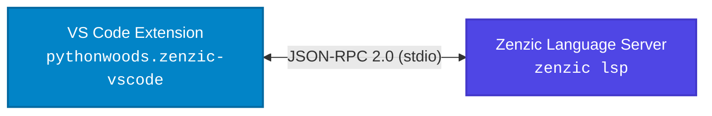

<!-- SPDX-FileCopyrightText: 2026 PythonWoods <dev@pythonwoods.dev> -->
<!-- SPDX-License-Identifier: Apache-2.0 -->
# Zenzic VS Code Extension

The official **Zenzic VS Code Extension** (`pythonwoods.zenzic-vscode`) brings sub-50ms deterministic diagnostics, credential scanning, and real-time topological validation directly into your authoring environment.

---

## Thin Client Architecture

The extension is designed as a **Thin Client**. It contains zero parsing engines, zero regex logic, and zero validation rules.

Instead, it relies on the Language Server Protocol (LSP) over `stdio` to communicate directly with your local Zenzic Python binary (`zenzic lsp`). This guarantees 100% parity between local editor feedback and CI/CD pipeline enforcement.



!!! important "Minimum Core Version Requirement"
    The VS Code Extension requires **Zenzic Core v0.30.0 or higher**. If the CLI is not
    already installed, the extension can provision it automatically — see [the Auto-Provisioning section](#auto-provisioning) below.

---

## Requirements

- **Zenzic Core**: `v0.30.0` or higher. Automatically provisioned on first use if not present (see [the Auto-Provisioning section](#auto-provisioning)).
- **VS Code**: `v1.125.0` or higher.

---

## Installation & Setup

=== "VS Code Extension Marketplace"

    Search for **Zenzic** in the VS Code Extensions panel (`Ctrl+Shift+X` / `Cmd+Shift+X`), or run:
    ```bash title="Terminal"
    code --install-extension pythonwoods.zenzic-vscode
    ```

=== "Zenzic Core Installation"

    Ensure the Zenzic Python binary is installed locally:
    ```bash title="Terminal"
    # Recommended: Global binary via uv
    uv tool install --force zenzic

    # Alternative: Standard pip install
    pip install zenzic
    ```

---

## Auto-Provisioning

Starting with v0.31.0 of the VS Code extension, **manual installation of the Zenzic CLI is optional for VS Code users**.

On first activation, if the extension cannot find a `zenzic` binary (via the configured path, system `$PATH`, or standard binary locations), it shows a consent prompt:

> *Zenzic CLI not found. Install it automatically in an isolated environment?*

Clicking **Install** triggers the Auto-Provisioning Engine, which:

1. Creates an isolated virtual environment inside VS Code's own global storage (`~/.config/Code/User/globalStorage/pythonwoods.zenzic-vscode/env/`).
2. Installs `zenzic >= 0.30.0` using `uv pip install` (primary path) or `pip install` in a `python3 -m venv` (fallback).
3. Verifies the installed binary version before starting the Language Server.
4. Persists the binary path in VS Code `globalState` to skip re-installation on subsequent activations.

!!! note "System isolation guarantee"
    The provisioned environment is strictly isolated. No changes are made to the user's system
    `$PATH`, `.bashrc`, `.zshrc`, or any other shell configuration file.

To disable auto-provisioning (e.g., for corporate proxy environments or air-gapped machines), set the following in your user or workspace settings:

```json title="settings.json"
{
  "zenzic.autoProvision": false
}
```

When `autoProvision` is `false`, the extension reverts to the manual-install flow and displays an actionable error message with a link to the installation documentation.

---

## Path Resolution & Local Development

The extension resolves the `zenzic` executable using a strict deterministic priority order:

1. **Explicit Custom Path**: If `zenzic.executablePath` is set (e.g. `${workspaceFolder}/.venv/bin/zenzic` or `~/bin/zenzic`), the extension tests and uses this explicit path first, scanning across all active workspace folders in multi-root setups.
2. **Active Virtual Environment**: Any active virtual environment on the current system or shell `$PATH`.
3. **Global System `$PATH`**: System directories containing a globally installed `zenzic` executable.
4. **Fallback Directories**: Standard user-level binary directories (`~/.local/bin`, `~/.cargo/bin`, `~/.uv/bin`).
5. **Auto-Provisioned Isolated Engine**: The sandboxed virtual environment in VS Code global storage (`pythonwoods.zenzic-vscode/env/`).

!!! tip "Local Core and Rule Development"
    If you are developing Zenzic rules or working on the core engine itself, install Zenzic in editable mode (`uv pip install -e .`) inside a local `.venv`. Set `zenzic.executablePath` to `${workspaceFolder}/.venv/bin/zenzic` to ensure the extension uses your live code instead of the Auto-Provisioned version.

---

## Configuration

The extension automatically discovers `zenzic` in standard `$PATH` directories and user bin locations (`~/.local/bin`, `~/.cargo/bin`, `~/.uv/bin`).

If you use a custom virtual environment or isolated installation, configure `zenzic.executablePath` in your workspace `settings.json`:

```json title=".vscode/settings.json"
{
  "zenzic.executablePath": "${workspaceFolder}/.venv/bin/zenzic"
}
```

!!! tip "Invalid custom path fallback"
    If you configure an invalid custom `zenzic.executablePath`, the extension prompts you with a **Clear Setting** button to safely clear the broken configuration and fall back to the Auto-Provisioning engine.

### Supported Settings

| Setting | Type | Default | Description |
|---|---|---|---|
| `zenzic.executablePath` | `string` | `"zenzic"` | Absolute path or binary name for the Zenzic executable. Supports leading `~/` and `${workspaceFolder}` (intelligently scans across all active workspace folders in multi-root setups). |
| `zenzic.autoProvision` | `boolean` | `true` | Automatically install the Zenzic CLI in an isolated environment if not found. Set to `false` to opt out. |
| `zenzic.autoFixOnSave` | `boolean` | `false` | Automatically apply Zenzic's deterministic Quick Fixes when a Markdown/MDX file is saved. Off by default — see [Auto-Fix on Save](#auto-fix-on-save) below. |
| `zenzic.autoRepairLinksOnRename` | `boolean` | `false` | Automatically rewrite inbound relative links when a file is renamed or moved. Off by default — see [Auto-Repair Links on Rename](#auto-repair-links-on-rename) below. |
| `zenzic.trace.server` | `string` | `"off"` | Trace LSP communication (`off`, `messages`, `verbose`). Useful for debugging. |

### Commands

The extension contributes the following commands to the Command Palette (`Ctrl+Shift+P` / `Cmd+Shift+P`):

| Command | Identifier | Description |
|---|---|---|
| **Zenzic: Restart Server** | `zenzic.restartServer` | Restarts the Language Server and re-indexes all workspace documents. |
| **Zenzic: Compute Global DQS** | `zenzic.computeDQS` | Executes on-demand global audit and updates the Status Bar score. |
| **Zenzic: Start Server** | `zenzic.startServer` | Starts the ZLS Language Server background process. |
| **Zenzic: Stop Server** | `zenzic.stopServer` | Stops the Language Server process. |
| **Zenzic: Show Status / Recovery** | `zenzic.showStatus` | Re-triggers error recovery dialogs or opens the quick action menu. |
| **Zenzic: Troubleshoot & Repair Setup** | `zenzic.troubleshoot` | Runs automated environment diagnostics and offers 1-click self-healing repairs. |

---

## Inline Diagnostics & Code Actions

The extension exposes real-time LSP diagnostics directly in the PROBLEMS panel and editor margin.

Zenzic provides automated Quick Fixes for 6 deterministic findings: injecting placeholder text for empty links (`Z108`), adding language tags to code blocks (`Z505`), wrapping bare URLs in angle brackets (`Z515`), stripping trailing heading punctuation (`Z517`), converting malformed pseudo-lists to valid Markdown lists (`Z520`), and removing dead suppressions (`Z603`).

In addition, Zenzic offers automated "Suppress this finding" Code Actions (`<!-- zenzic:ignore:ZXXX -->`) for all suppressible diagnostics. Hovering over a finding allows you to insert an inline suppression directive on the line above with a single click. To enforce security governance, suppression Code Actions are intentionally disabled for Security findings (`Z2xx`), which must be remediated at the source.

---

## Auto-Fix on Save

Set `zenzic.autoFixOnSave` to `true` to automatically apply the same 6 Quick Fixes above whenever a Markdown/MDX file is saved — no manual `Ctrl+.` needed. **Off by default**: silently rewriting file content on every save can surprise a workflow or conflict with another formatter also running on save.

Safety behavior: if any occurrence of a fixable finding is inline-suppressed anywhere in the file, that specific finding code is skipped entirely for that save — a suppressed occurrence is never rewritten, even if a different, un-suppressed occurrence of the same code exists elsewhere in the file. A scan or fix error also skips the save's auto-fix rather than risking a partial or incorrect edit.

---

## Auto-Repair Links on Rename

Set `zenzic.autoRepairLinksOnRename` to `true` to automatically rewrite inbound relative links across the workspace whenever a Markdown/MDX file is renamed or moved. **Off by default**: unlike auto-fix-on-save, this can rewrite files you didn't directly touch — every file that linked to the renamed one.

Scope and safety behavior:

- Only plain relative links (e.g. `[text](./old-name.md)`) are rewritten. Docs-root-relative links (a leading `/`) and `@site/...` alias links are always left untouched, since reconstructing the correct alias form is ambiguous.
- A file excluded via `.zenzic.toml` is never rewritten, even if it links to the renamed file.
- If repairing several inbound links at once and one linking file cannot be safely updated, the others are still repaired independently — Zenzic never skips a whole rename's worth of fixes because one file failed.
- Renaming a folder (rather than a single file) is not currently handled by this feature.

---

## Domain Boundaries & Supported Files

To uphold **Domain-Aware Discovery** and **Radical Unawareness**:

- **File Extensions**: The extension and Language Server exclusively target Markdown (`.md`) and MDX (`.mdx`) files. Non-documentation files (e.g. `OWNERS`, `.gitignore`, `config.yaml`) are automatically filtered out.
- **Configured Domain**: Only files residing within the configured `docs_dir` (default: `docs/`) or `extra_content_roots` are evaluated. Out-of-bounds files in the workspace (such as root `README.md` when `docs_dir = "docs"`) produce zero diagnostics.

> **Having issues?** See the [Troubleshooting Guide](../how-to/troubleshooting.md#editor-integration).
