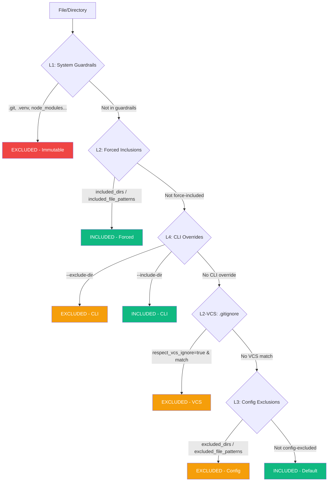

<!-- SPDX-FileCopyrightText: 2026 PythonWoods <dev@pythonwoods.dev> -->
<!-- SPDX-License-Identifier: Apache-2.0 -->

# Discovery & Exclusion

Every Zenzic check -- links, orphans, snippets, unused assets, nav contract, directory indices, config assets, and the reference/content/security pipeline (which also covers placeholders, brand rules, and credential scanning) -- operates on the same set of files. This guarantee is enforced by a **single entry point** for file discovery and a **4-level exclusion hierarchy** that determines which files and directories are included or excluded from scanning.

---

## The Authority of Root {#root-authority}

Before Zenzic can discover, exclude, or scan a single file, it must answer one question:
**where does this project begin?**

Zenzic is a workspace-scoped tool. It does not analyse arbitrary directories; it analyses
**defined projects**. To establish the project boundary, Zenzic performs an **upward traversal**
from the target path, searching for a recognised root marker.

### Root Markers {#root-markers}

Four markers are authorised (first match wins):

| Marker | Description |
| :--- | :--- |
| `.git/` | Universal VCS marker — present in any Git-tracked repository |
| `.zenzic.toml` | Zenzic's own configuration file — the explicit governance contract |
| `zensical.toml` | A Zensical project's own configuration file |
| `mkdocs.yml` | An MkDocs project's own configuration file |

### Why a Root Marker is Mandatory {#why-mandatory}

Without a root marker (VCS or configuration), Zenzic cannot establish the project's **Sovereignty Perimeter**. This is required for four independent reasons:

- **Resolve relative paths** — every finding is expressed as a path relative to the root. Without a fixed anchor, file locations are ambiguous and non-reproducible across machines.
- **Map the workspace into the VSM** — Zenzic always builds a Virtual Site Map, regardless of adapter. In engine mode (MkDocs, Zensical), the VSM includes ghost routes, slug transformations, and virtual pages. In Standalone Mode, the VSM is a 1:1 projection of the filesystem. In both cases, the root defines the zero-point for canonicalising every internal reference — so that `index.md` at the root is unambiguously distinct from `index.md` in a subdirectory.
- **Apply `directory_policies`** — governance contracts match paths via glob patterns relative to the workspace root. Without a defined root, exemption rules are non-deterministic and cannot be applied consistently.
- **Prevent Massive Indexing** — without an explicit boundary, the engine could accidentally scan the entire host filesystem, producing incoherent results and risking information leakage.

The absence of a root marker produces this error:

```text
ERROR: Could not locate repo root: no .git directory, .zenzic.toml, zensical.toml,
or mkdocs.yml found in any ancestor of /path/to/target. Run Zenzic from inside the
repository.
```

This is not a configuration error. It is a **safety guarantee**: the Quality Gate halts
an out-of-bounds scan before it begins.

### Resolution Options {#root-resolution}

Zenzic resolves the repository root by walking up from the current working directory until it finds a root marker (`.git/`, `.zenzic.toml`, `zensical.toml`, or `mkdocs.yml`). Three conditions satisfy this requirement:

- **Zenzic project:** a `.zenzic.toml` file in the target directory root (created by `zenzic init`).
- **Git repository:** a `.git/` directory anywhere in the ancestor tree.
- **Nested invocation:** running from inside an existing project that already contains any of the four markers.

If none of these conditions are met, Zenzic rejects the invocation with an explicit error.

> See [Getting Started](../how-to/install.md) for the `zenzic init` setup workflow.

---

## Single Entry Point: `iter_markdown_sources` {#iter-markdown-sources}

All modules that need to iterate over documentation source files must call `iter_markdown_sources`. Direct calls to `Path.rglob()`, `os.walk()`, or `Path.iterdir()` from scanner, validator, or credential scanner are prohibited by design. This function:

1. Walks the `docs_root` directory using `os.walk()` with **in-place directory pruning** (excluded subtrees are never entered).
2. Yields only `.md` and `.mdx` files, in deterministic sorted order. The
   suffix comparison ignores letter case, so `.MDX` and `.Mdx` are discovered
   exactly as `.mdx` is.
3. Delegates all exclusion decisions to the `LayeredExclusionManager`.

### MDX Support {#mdx}

MDX is a supported format, not a qualified exception. `.md` and `.mdx` are
discovered by the same walk, in any letter case, with nothing to configure — and
every rule in the catalogue applies to both.

!!! warning "If your site links by route, configure an adapter first"
    This is about the **site**, not about MDX, and it applies to a Markdown site the same
    way — but MDX sites hit it hardest because linking by absolute route is the idiom in
    Astro, Docusaurus and Next.js. With the default `standalone` adapter Zenzic has no way
    to know your URL convention, so `/guides/example/` cannot be resolved: it is reported
    as `Z101`, and the absolute path is reported again as `Z105`. Measured on Astro's own
    documentation, that is **2,214 of 2,215 `Z101` findings — none of them a broken link**.

    The fix is [`prebuilt` with a route manifest](../how-to/configure-adapter.md#prebuilt-route-manifest),
    which brings the same corpus down to the links that are genuinely broken. Read that
    before running Zenzic over a route-linked site, rather than after.

    **Measured on scaffolded builds of both generators**, not extended by analogy from one:
    an Astro Starlight site goes from 4 findings to 1, a Docusaurus classic site from 8 to 1,
    and in each case the survivor is the link that is actually broken. The *recipe* differs
    between them — Docusaurus needs its own metadata rather than filename-derived URLs, and
    needs `baseUrl` and `routeBasePath` handled — so follow the per-generator guidance rather
    than adapting one to the other.

    **The Docusaurus recipe holds for a single-locale, unversioned site and not beyond it.**
    Both conventions were then tested and both break it: i18n silently, because `.docusaurus/`
    is rewritten per locale build and the manifest ends up describing the last one — 19 of 24
    entries claimed the wrong locale and 6 valid links were reported broken. Versioning
    inverts the mapping, moving the working copy to `/docs/next/`. The how-to states both
    failures and what the documented alternative would be. Where this page says a construct
behaves "exactly as in `.md`", that was verified by running the engine on both,
not inferred.

An `.mdx` file is parsed as Markdown with raw HTML, not by an MDX parser. Its
Markdown constructs — links, images, headings, credentials — behave exactly as
they do in `.md`. What follows is what that buys, each point verified by
execution:

- `<a>`, `` and `<link>` participate fully in link, asset and
  forbidden-scheme checks, in any letter case. A `` component is
  checked as well, because its tag name matches `img`.
- JSX components participate as well. A capitalised tag carrying `to`, `href` or
  `src` is analysed exactly as `<a href>` is: a broken target is reported, and a
  forbidden scheme in it exits 2. The recognition rule is the JSX convention
  itself — lowercase is an HTML element, capitalised is a component — rather than
  a list of names, so `<Link>`, `<Anchor>` and a component nobody has written yet
  are all covered without the engine knowing what a framework is.
- The attribute side is a fixed set (`to`, `href`, `src`) where the tag side is a
  rule, and the asymmetry is deliberate: component names are unbounded, so a list
  of them creates a blind spot the day someone invents a fourth, while attribute
  names are where false positives live. A component carrying none of those three
  props is not a link and reports nothing, and its other props are not audited as
  HTML attributes. A bespoke prop — `<Card link="...">` — is not covered.
- Inline suppression accepts the JSX comment form. `{/* zenzic:ignore: Z515 */}`
  does in an `.mdx` file exactly what `<!-- zenzic:ignore: Z515 -->` does in a
  `.md` one — same placement, same effect, same debt point. Both belong **at the
  end of the line the finding is on**; on the line above, neither suppresses
  anything and the directive is itself reported as `Z603 DEAD_SUPPRESSION`.
- A Markdown link written inside a comment — MDX (`{/* ... */}`) or HTML
  (`<!-- ... -->`) — or inside a JSX string attribute is **not** reported as a
  broken link. None of them renders as a link, so none is one. The masking that
  establishes this is length-preserving, so reported line numbers and caret
  columns are unchanged by it. Links in JSX *expression* attributes
  (`to={"./page.mdx"}`) are outside that masking and behave as before. This
  applies to the **quality** tier only — a forbidden scheme or a traversal
  written in a comment *is* reported, for the reasons in
  [Two Masks, Two Questions](#two-masks) below.

### Two Masks, Two Questions {#two-masks}

Masking is not one mechanism but two, because two different questions are being
asked of the same document.

The **quality tier** asks *is this text content?* A link inside a comment, a math
span or a code fence is not a link — it renders as text or not at all — so
reporting it as broken would be a false positive. That tier masks comments, math
spans, fences and JSX string attributes before extracting.

The **security tier** asks a different question: *does this document contain a
forbidden scheme or a traversal?* For that question the whole document is in
scope, because a payload is no less real for sitting inside a comment. Sharing
the quality mask here meant the scanner never looked, and *not looking* is a
stronger suppression than any directive — `Z202`, `Z203` and `Z205` are declared
non-suppressible precisely so that no document can silence them.

The rule that separates them is **whether the author declared the content an
exhibit, and whether the payload reaches the rendered page**:

| Construct | Quality tier | Security tier | Why |
| --- | --- | --- | --- |
| Closed, well-formed fence | masked | **masked** | An explicit, structural declaration that this is an exhibit. Fenced text renders inert — it never becomes a clickable anchor. |
| HTML or MDX comment | masked | **not masked** | Declares something about *rendering*, not about content. Unrendered text is still text. |
| Inline math span (`$…$`) | masked | **not masked** | Declares nothing at all: two `$` on one line, which prose about prices produces by accident. |
| Unterminated fence | masked (to end of file) | **not masked** | An authoring error, not a declaration — and it would silence every remaining line. |

#### Accepted residual risk {#fence-residual-risk}

A closed fence remains a place where a payload is invisible to the security tier.
**This is accepted, not overlooked.** Two reasons:

1. **Fenced content is inert by construction.** Markdown and MDX both render it
   as text, never as an anchor, so a `javascript:` URL inside a fence is not the
   live vector an unfenced one is.
2. **Unmasking it would make rule documentation unfixable.** Zenzic's own pages
   for `Z203` and `Z205` teach those rules by showing the payloads. `Z205` exits
   `2` and cannot be suppressed, so an unmasked pass would fail those pages with
   no available remedy short of deleting the examples that make them useful.

The consequence for anyone editing a rule page: **an example payload must stay
inside a closed fence.** Unfencing one turns the page into an unsuppressible
build failure.

The benefit is architectural: when a directory is excluded, it is excluded everywhere -- scanner, validator, credential scanner, and orphan-checker all see the exact same file set. There is no risk of one module "forgetting" to apply an exclusion rule.

The function takes three arguments:

1. `docs_root` -- absolute path to the documentation root.
2. `config` -- loaded Zenzic configuration (provides `excluded_dirs`).
3. `exclusion_manager` -- the `LayeredExclusionManager` used for the full 4-level evaluation.

---

## Layered Exclusion Hierarchy {#layered-exclusion}

Zenzic uses a 4-level exclusion model, named L1-L4. Each level's *name* reflects its role, not
its evaluation position — the real evaluation order (per `src/zenzic/core/exclusion.py`'s own
module docstring) is L1, L2 (Forced Inclusions), **L4 (CLI Overrides)**, L2-VCS, L3 (Config
Exclusions), Default. CLI overrides are checked before VCS-ignore and config exclusions, not
after — so `--include-dir` can currently override both `.gitignore` and `.zenzic.toml`
`excluded_dirs`. The hierarchy is evaluated top-to-bottom in that real order; the **first
matching rule wins**.

### The Four Levels {#four-levels}



| Level | Name | Source | Mutable? |
| :---: | :--- | :--- | :---: |
| **L1** | System Guardrails | Hardcoded in `SYSTEM_EXCLUDED_DIRS` | No |
| **L2** | Forced Inclusions + VCS | `included_dirs`, `included_file_patterns`, `.gitignore` | Yes (config) |
| **L3** | Config Exclusions | `excluded_dirs`, `excluded_file_patterns` in `.zenzic.toml` or `[tool.zenzic]` in `pyproject.toml` | Yes (config) |
| **L4** | CLI Overrides | `--exclude-dir`, `--include-dir` flags | Yes (per-run) |

### L1 -- System Guardrails {#l1-system-guardrails}

System Guardrails are **immutable**. They are always excluded regardless of any configuration, CLI flag, or forced inclusion. They protect Zenzic from scanning directories that should never contain documentation source files:

```text
.git          .github       _zenzic_core  .zenzic_cache
.venv         node_modules  .nox          .tox
.pytest_cache .mypy_cache   .ruff_cache   .hypothesis
build         dist          temp          .temp
tmp           mutants       out           .vscode-test
```

System Guardrails cannot be removed or overridden. They are merged into `excluded_dirs` unconditionally during config initialization. Even `included_dirs` cannot override them -- this is the sole exception to the forced-inclusion rule.

### L2 — Forced Inclusions + VCS {#l2-forced-inclusions-vcs}

Forced inclusions take precedence over all exclusion layers except L1. They serve two purposes:

**Config-level forced inclusions** (`included_dirs`, `included_file_patterns`) re-include files or directories that would otherwise be excluded by VCS patterns or config exclusions. A typical use case is build-generated API documentation listed in `.gitignore` but requiring linting.

**VCS exclusion** (`.gitignore` patterns) is activated by setting `respect_vcs_ignore = true`. When active, Zenzic reads `.gitignore` files from both the repository root and the docs directory. Files matching VCS ignore patterns are excluded — but forced inclusions override VCS exclusions.

### L3 — Config Exclusions {#l3-config-exclusions}

Config-level exclusions from `.zenzic.toml` or `pyproject.toml`:

- `excluded_dirs` — directory names inside `docs/` to skip
- `excluded_file_patterns` — filename glob patterns to skip

These are additive to L1 but subordinate to L2 forced inclusions.

### L4 — CLI Overrides {#l4-cli-overrides}

Per-run overrides via `--exclude-dir` and `--include-dir` flags extend or narrow the scan scope for a single invocation without modifying the persistent configuration. CLI `--include-dir` cannot override System Guardrails — attempting to include `.git` or `.venv` via CLI is silently ignored.

> For field-level syntax and examples, see [Configuration Reference](../reference/configuration-reference.md).

---

## `respect_vcs_ignore` — VCS Exclusion Semantics {#respect-vcs-ignore}

`respect_vcs_ignore` controls whether Zenzic applies `.gitignore` patterns as an additional exclusion layer. Its default is `true` — the scan perimeter follows the same VCS-ignore boundary the rest of the toolchain already respects. See [Exclusion Design](./exclusion-design.md) for the rationale and the tradeoffs of disabling it, and [Configuration Reference](../reference/configuration-reference.md#respect-vcs-ignore) for the field-level specification.

When enabled, Zenzic loads `.gitignore` patterns from two locations: the repository root and the docs directory (if a separate `.gitignore` exists there). The VCS ignore parser implements the full gitignore specification, including negation (`!`), path anchoring, and glob wildcards.

Forced inclusions (`included_dirs`, `included_file_patterns`) always override VCS exclusions. This is what makes it safe to enable `respect_vcs_ignore` in projects where build-generated documentation is in `.gitignore` but still requires linting.

---

## Exclusion Zone Philosophy {#privacy-gate}

The Layered Exclusion model implements the **Exclusion Zone** principle: Zenzic creates a protected scanning environment where the file set is deterministic, reproducible, and fully controlled by the project maintainer.

The philosophy has three tenets:

1. **Determinism** -- Given the same config and filesystem state, `iter_markdown_sources` yields the exact same files in the exact same order. No randomness, no race conditions, no environment-dependent behaviour.

2. **Safety by default** -- System Guardrails prevent Zenzic from scanning VCS internals, virtual environments, or build caches. These directories could contain thousands of files irrelevant to documentation quality.

3. **Explicit override** -- Every inclusion and exclusion is traceable to a specific configuration line or CLI flag. There are no hidden heuristics or "smart" detection that could surprise a user.

The Privacy Gate (Exclusion Zone) defines a strict boundary where Zenzic's scanners are intentionally inhibited to protect sensitive metadata or intentional security-testing patterns.

---

## Performance Notes {#performance}

- **Directory pruning** is applied during `os.walk()`, not after. Excluded subtrees (e.g. `node_modules/` with thousands of files) are never entered.
- For non-Markdown files, `walk_files()` uses the same `os.walk()` engine with in-place pruning. Unlike `Path.rglob("*")`, it never enters excluded trees.
- File patterns are **pre-compiled** to RE2 patterns at `LayeredExclusionManager` construction time using `translate_glob_to_re2()` — a purpose-built translator, not `fnmatch.translate()`, since RE2 doesn't support every construct `fnmatch.translate()` can emit.
- VCS patterns are delegated to the third-party `pathspec.PathSpec.from_lines()` (`GitWildMatchPattern`), not a Zenzic-authored combined-regex fast path.
- The `LayeredExclusionManager` is constructed **once** per CLI invocation and passed by reference through the entire pipeline.
- A separate hard-prune set is used by `find_unused_assets` for `excluded_asset_dirs`.

---

## Multi-Root Discovery {#multi-root}

`docs_dir` is the canonical source root, but modern static-site generators routinely manage **content trees that live outside `docs/`**. The textbook case is a `blog/` directory: it is materialised as live URLs at build time, yet a pre-current series Zenzic scan would never see the files inside it. The Virtual Site Map ingested only files under `docs_root`, so broken links inside (or pointing to) blog posts slipped past `zenzic check all` and only surfaced when the build failed downstream. We call this failure mode **VSM Blindness**.

Multi-Root Discovery cures the blindness by letting the active adapter declare additional content roots — each carrying a physical path, a URL prefix, and a diagnostic label. When extra content roots are declared, all pipeline stages treat those files as first-class content alongside the primary `docs/` tree.

### Auto-discovery without `subprocess` {#auto-discovery}

Adapter implementations honour the **Zero Subprocess** invariant. Configuration files (like `zensical.toml` or `mkdocs.yml`) are parsed statically without spawning any subprocess. No engine binary is ever executed — configuration is read as **data**, not executed as code. Pillar 2 (Engine Sovereignty) is preserved.

### Traceability invariant {#traceability}

Every entry in the VSM, including those produced by an extra content root, carries a `Route.source` that resolves back to a real file on disk. A route with no physical origin would be a validator screaming `error` without ever saying `where`.

### Reverse-Mapping Invariant & Virtual Routes {#reverse-mapping}

Multi-Root Discovery (current series) solved **VSM Blindness** for physical files outside
`docs/`. current series extends the guarantee to **engine-generated pages**: engines may render
URLs — tag pages, paginated indexes, author profiles — that have no physical Markdown
counterpart. These routes exist only in the build output, never on disk.

The invariant guarantees that every engine-generated URL traces back to at least one source file. Adapters opt in by implementing the optional `get_virtual_routes()` method; virtual routes participate in collision detection on equal footing with physical routes.

### Engine support matrix {#engine-support}

| Engine          | Implements `get_extra_content_roots` | Status                                                                |
|-----------------|--------------------------------------|------------------------------------------------------------------------|
| MkDocs (Material) | Yes                                 | Discovers monorepo docs roots via `_discover_monorepo_docs_roots()`.  |
| Zensical        | No                                   | Architecture is identical -- enabled when an out-of-tree plugin ships. |
| Standalone      | No                                   | No plugins; `docs_root` is the entire content surface.                 |

Monorepo sub-projects are found from the `mkdocs-monorepo-plugin` configuration and
from `nav`. Every documented `!include` spelling is recognised: a bare list entry
(`- '!include ./sub'`), an entry keyed on the directive, and the plugin's own titled
form (`- Sub: '!include ./sub/mkdocs.yml'`). The `nav` tree is walked recursively, so
an include nested inside a section is found too. This matters beyond navigation: the
roots discovered here are what the credential scan walks, so a sub-project Zenzic
cannot reach is a sub-project it cannot scan.

### `inspect routes` — Site Map Export {#inspect-routes}

The `inspect routes` command exposes the VSM to external consumers as a deterministic JSON structure. Each record carries four fields: `url`, `kind` (one of `physical`, `tag`, `tag_index`, `pagination`, `author`, or `author_index`), `source_files` (a sorted array of repo-relative paths that cause the URL to exist), and a `digest` — a SHA-256 fingerprint derived from the URL and its source files.

The `--kind` flag narrows output to `physical`, `virtual`, or `all` (default) — a coarser filter than the record's own `kind` field, where `virtual` matches every non-`physical` value above.

This design makes the VSM composable: external tools, CI/CD dashboards, or specialized tooling can consume the site map without running the full scanner.

> CLI syntax: see [CLI Reference — `inspect routes`](../reference/cli.md).
