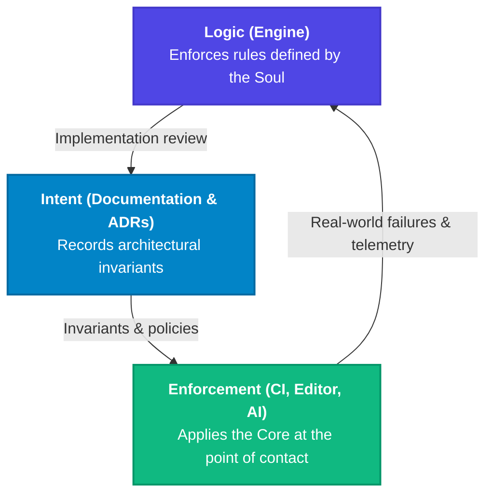

<!-- SPDX-FileCopyrightText: 2026 PythonWoods <dev@pythonwoods.dev> -->
<!-- SPDX-License-Identifier: Apache-2.0 -->

## The Zenzic Trinity: Logic, Intent, and Enforcement

Zenzic is a **Sovereign Knowledge System** — an ecosystem where
logic, intent, and enforcement are permanently synchronized. To deliver a true
[Exclusion Zone](./privacy-gate.md), Zenzic is organized into a Trinity of Integrity: three
concerns that form a closed feedback loop, each reinforcing the others.

The Trinity divides **concerns**, not repositories. Logic and intent — the engine, and the
documentation that defines why the engine behaves as it does — live together in the
[`zenzic`](https://github.com/PythonWoods/zenzic) repository. Enforcement is deliberately
not a single place at all: the same rules are applied in CI, in the editor, and to any
system that consumes them, each through its own thin surface over the identical engine.
A reader looking for a repository map will not find one here; this page is about which
guarantees hold and why, not about where files are stored.

---

## 1. Logic — The Body {#core-the-body}

The [`zenzic`](https://github.com/PythonWoods/zenzic) repository is the **tactical execution
layer**. It contains every line of analysis logic that enforces the Three Pillars, and — in
the same repository, reviewed in the same commits — the Constitutional Layer that decides
what those rules should be.

### The analysis engine

| Component | Role |
|-----------|------|
| **Virtual Site Map (VSM)** | Builds an in-memory projection of the final site from source files alone. No build required. |
| **Credential Scanner** | Scans every line of raw source for credential patterns before any other pass. |
| **Adapter Protocol** | Translates engine-specific configuration (MkDocs, Zensical, Standalone) into a unified analysis model. |
| **Layered Exclusion Manager** | Unifies system guardrails, forced inclusions, CLI overrides, VCS ignores, and user configuration into a single, deterministic pass hierarchy to guarantee a clean scan scope. |

The Core enforces the law. It does not decide the law.

### Why Zenzic if my Static Site Generator (SSG) already checks for broken links?

1. **Speed & Shift-Left:** SSG builds (Node.js, Go, or Python based) require full site compilation and commonly run in slower CI feedback loops. Zenzic runs local static analysis on source text and metadata before build, with pre-commit feedback in milliseconds.
2. **Actionable Diagnostics:** When generated routes fail, SSG output is typically a generic 404/build failure. Zenzic uses VSM reverse mapping to report the exact source file and frontmatter context that generated the failing virtual route.

Security and governance enforcement (credential leaks, path traversal, brand obsolescence, orphaned assets) are covered in [Why Zenzic — Risk Prevention](./why-zenzic.md), not repeated here.

---

### Intent — The Soul {#documentation-the-soul}

The same repository's `docs/` tree is the **Constitutional Layer**. It is not merely a user
manual — it is the source of truth that defines *why* the engine exists and *why* every rule
is the way it is.

That logic and intent share a repository is the point, not an accident of filing. A rule and
the reasoning that justifies it are versioned together, reviewed in the same diff, and
released as one unit — so neither can quietly move without the other.

#### The Diátaxis Framework

Content is organized into four strict quadrants: **Tutorials** (learning), **How-to Guides**
(tasks), **Reference** (exhaustive data), and **Explanation** (understanding). This prevents
content drift: every contributor always knows exactly where a new piece of knowledge belongs.

#### Architectural Decision Records (ADRs)

Every major technical choice is codified in an ADR stored under
`developers/explanation/`. Each record states the problem, the decision, the
rationale, and the permanent consequences. The ADRs are the project's institutional memory —
the written proof that no decision was made carelessly.

The ADR corpus ensures the Exclusion Zone philosophy remains stable over time, regardless of who
contributes to the project in the future.

---

## 2. Enforcement — The Arm {#action-the-arm}

Enforcement is the **operational layer**: it puts the Core's verdict in front of someone who
can act on it. Crucially, it is not one product but a set of thin surfaces over the identical
engine — the guarantee is the same wherever you meet it, and only the moment of contact
changes.

| Surface | Where it applies the rules | Status |
| :--- | :--- | :--- |
| [`zenzic-action`](https://github.com/PythonWoods/zenzic-action) | In CI, as a merge gate on the pull request | Released |
| [`zenzic-vscode`](https://github.com/PythonWoods/zenzic-vscode) | In the editor, at the keystroke, before a commit exists | Released |
| [`zenzic-mcp`](https://github.com/PythonWoods-Dev/zenzic-mcp) | To AI systems consuming the analysis directly | In development, not yet released |

Each is a thin client, which is what keeps the promise honest: none of them re-implements a
rule, so a finding cannot mean one thing in the editor and another in CI. This is the same
property [ADR-075's Radical Unawareness](../developers/explanation/adr-vault/records/adr-075-radical-unawareness.md)
guarantees from the other direction — the Core does not know which surface is calling it, so
it cannot behave differently for one of them.

The CI surface is the one with a formal contract worth stating here:

```yaml title=".github/workflows/zenzic.yml"

- uses: PythonWoods/zenzic-action@<version>

  with:
    version: "<version>"
    format: sarif
    upload-sarif: true
    fail-on-error: true
```

The Action exposes the Core's [exit code contract](../reference/finding-codes.md) directly to
GitHub Actions runners: quality findings (exit 1) are configurable; security incidents
(exit 2/3) are **never suppressible**. The CI gate is mathematically identical to the local gate.

---

## The Feedback Loop {#feedback-loop}

The Trinity is not a hierarchy — it is a **cycle**. Each concern informs and constrains the
others:



A change to the Core that is not reflected in the Soul is a **ghost commit**. An Action that
exposes behaviour not documented in the Soul is a **silent contract**. The Trinity is only
complete when all three are in synchronisation — which is enforced by the [Law of Contemporary Testimony](../developers/explanation/governance/evolution_policy.md).

Two of the three edges close inside a single repository, and that is what makes them cheap to
hold: a ghost commit is catchable in ordinary code review, because the code and the
documentation it contradicts appear in the same diff. The enforcement edge is the one that
crosses a release boundary — every surface ships on its own cadence — so it is the edge that
needs the release protocol rather than review alone.

---

## Architectural Awareness {#architectural-awareness}

Zenzic is engineered for **Institutional Memory**. Two properties make this possible:

### Deterministic Rule Surface — The Structural Mirror

The `zenzic` core exposes a deterministic rule surface through its code registry,
finding catalog, and adapter contracts. Structural state is read from explicit
registries and stable command outputs (`inspect capabilities`, `inspect codes`,
`inspect routes`) rather than inferred from runtime heuristics.

### ADR Corpus — The Decision Mirror

Every architectural choice lives in a structured Markdown file. `## Context` and `## Decision`
are universal across the ADR corpus; most records also carry `## Rationale` (or, in a minority,
`## Consequences`) and a `**Status:**`/`**Date:**` metadata line, though the exact metadata
fields aren't fully standardized across every record yet. This makes the decision history
readable and traceable by design, even where the metadata schema is still converging.

Together, the deterministic rule surface and the ADR corpus form a **transparent context layer**:

- **For humans:** a clear, predictable path from philosophy to implementation — no archaeology

  required.

- **For automation systems:** a structured, unambiguous context that keeps generated

  suggestions aligned with the project's fundamental invariants.

!!! info The Exclusion Zone is a Sovereign Knowledge System
    Zenzic is not just a tool you use. It is an ecosystem you can trust — because its rules,
    decisions, and structure are always legible, always synchronized, and always honest.
