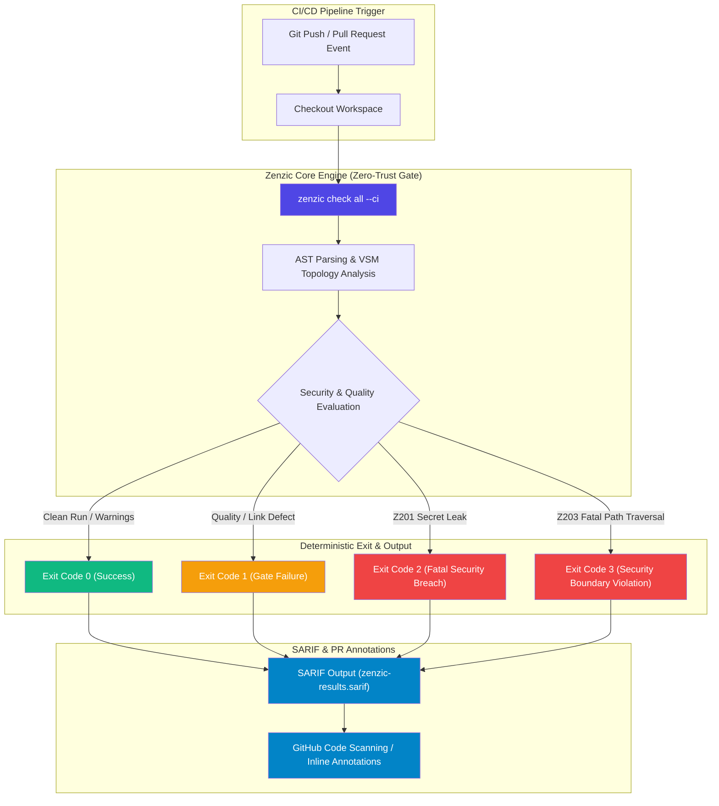

<!-- SPDX-FileCopyrightText: 2026 PythonWoods <dev@pythonwoods.dev> -->
<!-- SPDX-License-Identifier: Apache-2.0 -->

# Zero-Trust CI/CD Quality Gate & SARIF Integration

Documentation drift is silent until a customer encounters a broken link in production or an unredacted API token reaches a public repository. Traditional CI linters attempt to catch syntax flaws, but fail to enforce structural contracts or prevent secret leaks before merge.

Zenzic provides a **Zero-Trust CI/CD Quality Gate**. The core engine evaluates your documentation repository, computes a deterministic Document Quality Score (DQS), and emits native SARIF (Static Analysis Results Interchange Format) output directly into GitHub Code Scanning and CI pipelines.

---

## CI/CD Pipeline Architecture

The following diagram illustrates how the Zenzic Core engine executes natively inside CI pipelines, producing machine-readable SARIF output and enforcing the strict Exit Code Contract:



---

## Exit Code Contract

Zenzic enforces a non-negotiable exit code contract across all operating systems, CI runners, and output formats (`text`, `json`, `sarif`):

!!! danger "Exit Code Contract"
    - **`Exit 0` — Success**: All statically-detectable links, anchors, references, and structural rules passed (or warnings suppressed within budget).
    - **`Exit 1` — Quality Gate Failure**: Hard errors (e.g. broken links `Z101`) always trigger this. Warning-severity findings — including orphan pages `Z402` and placeholder text `Z501`, both `warning`-severity by default — only trigger it under `--strict` (which `--ci`, used throughout this page's examples, enables automatically). `suppression_cap` exceeded also triggers this.
    - **`Exit 2` — Fatal Security Breach**: Hardcoded credentials (`Z201`), forbidden terms (`Z204`), or forbidden URL schemes (`Z205`). Non-suppressible.
    - **`Exit 3` — Security Boundary Violation**: Fatal path traversal (`Z203`). Non-suppressible. (`Z202`, ordinary path traversal, stays a plain Exit 1 finding — not escalated.)

---

## Local Quality Gate (Before You Push) {#local-quality-gate}

> *Don't debug the build output. Fix the source before the build starts.*

A documentation error discovered in CI means a failed pipeline, a context switch, and a
wasted build minute. Discovered **before** the build, it is just a one-line fix. The Quality
Gate pattern closes the gap: Zenzic runs as a mandatory pre-step, blocking the build command
if the source is not clean — the same analysis that runs in your GitHub Actions workflow,
applied at the moment when fixing it is cheapest:

```text
zenzic check all [PATH] --strict  →  success  →  your build tool
                                  →  failure  →  build blocked
```

| Discovery point | Cost to fix |
| :--- | :--- |
| **Before the build** (local gate) | Seconds — the editor is still open |
| **CI pipeline** | Minutes — push, wait, read log, fix, re-push |
| **Production deploy** | Hours — rollback, triage, hotfix |

By the time CI runs, the documentation is already clean — CI becomes a **confirmation**
rather than a **detector**.

### Recipes by Ecosystem

Pick the recipe that matches your build toolchain.

**Python Ecosystem (uv / justfile / Makefile)** — MkDocs projects typically use
`uv run mkdocs build` or a `justfile`. Gate the build recipe:

```just title="justfile"
# Quality Gate — Zenzic must pass before MkDocs builds
build:
    uv run zenzic check all --strict {{ ZENZIC_EXTRA_ARGS }}
    uv run mkdocs build --strict
```

For `Makefile` users (recipe lines must be tab-indented, not space-indented):

<!-- markdownlint-disable MD010 -->
```makefile title="Makefile"
build:
	uv run zenzic check all --strict $(ZENZIC_EXTRA_ARGS)
	uv run mkdocs build --strict
```
<!-- markdownlint-enable MD010 -->

Both commands in the recipe run sequentially. A non-zero exit from `zenzic check all`
aborts the recipe before `uv run mkdocs build` is reached.

**Standalone (any tool)** — for projects without a build engine, the pattern is always
the same:

```bash
uvx zenzic check all . --strict && your_build_command
```

The `&&` operator short-circuits: if Zenzic exits non-zero, `your_build_command`
is never executed. Combine with any `Makefile`, `justfile`, `package.json` script,
or shell script entry point.

### Pre-Launch and Staging Environments {#pre-launch}

External links to sites that are not yet public — documentation domains, GitHub release
tags, staging URLs — return HTTP 404 until the deploy completes. The Quality Gate
blocks the build on these, which is correct behaviour: a broken external link is a
real finding.

When you are **deliberately building documentation before the target site goes live**,
instruct the gate to skip external checks for that run using `ZENZIC_EXTRA_ARGS`:

```bash
# Skip all external link checks — pre-launch or network-restricted environments
ZENZIC_EXTRA_ARGS="--no-external" just build

# Exclude one specific pre-launch domain, keep all other external checks active
ZENZIC_EXTRA_ARGS="--exclude-url https://zenzic.dev/" just build
```

`ZENZIC_EXTRA_ARGS` is an environment variable read by both `just verify` and
`just build`. It injects flags into the Zenzic invocation without modifying
`.zenzic.toml` or the justfile — the source of truth for configuration remains
unchanged. Unset, it expands to empty and the gate behaves at full strictness.

!!! warning "Explicit exception, not a new default"
    `ZENZIC_EXTRA_ARGS` must be set explicitly on each invocation. It is not persisted
    in any configuration file. Run `just build` without the variable to confirm that the
    gate still blocks on the broken links:

    ```bash
    just build
    # [Z109] External URL returned an HTTP error or could not be reached: 'https://zenzic.dev/blog/'
    # FAILED: Hard errors detected. Exit code 1 is mandatory.
    ```

    The protection is active by default. The variable is an operator exception, not a
    configuration change.

The finding above is what a pre-launch external link looks like. It is accurate — the
URL does not resolve. `ZENZIC_EXTRA_ARGS="--no-external"` suppresses it for one build
invocation only.

---

## Workflow Integration Examples {#github-actions-zenzic-credential-gate}

=== "Pre-Commit Hook (.pre-commit-config.yaml — Recommended Local Gate)"

    Shift-left quality enforcement by blocking secret leaks and structural errors on developer workstations before commits are pushed:

    ```yaml title=".pre-commit-config.yaml"
    repos:
      - repo: https://github.com/PythonWoods/zenzic
        rev: v0.30.0  # Pinned version for deterministic local verification
        hooks:
          # Fast staged-file credential & forbidden pattern scanner (<50ms per commit)
          - id: zenzic-guard

          # Optional: full repository graph & link integrity audit (pre-push stage)
          # - id: zenzic-verify
          #   stages: [pre-push]
    ```

    `zenzic guard init` scaffolds or updates a separate file — `.pre-commit-hooks.yaml`, the
    hook-*definition* file a repo publishes so other projects can consume its hooks (this is
    the file `zenzic` itself ships at its own repository root). It does not write to the
    `.pre-commit-config.yaml` shown above, which downstream consumers edit by hand:

    ```bash title="Terminal"
    zenzic guard init
    ```

=== "GitHub Action Wrapper (Automated CI & SARIF Annotations)"

    The official [`PythonWoods/zenzic-action`](https://github.com/PythonWoods/zenzic-action) serves as the CI-side counterpart to local pre-commit hooks, providing zero-config pull request enforcement and automatic SARIF upload:

    ```yaml title=".github/workflows/zenzic.yml"
    name: Zenzic Documentation Quality Gate

    on:
      push:
        branches: [main]
      pull_request:
        branches: [main]

    jobs:
      zenzic-gate:
        runs-on: ubuntu-latest
        permissions:
          contents: read
          security-events: write  # Required for SARIF Code Scanning alerts
        steps:
          - uses: actions/checkout@v4

          - name: Execute Zenzic Quality Gate
            uses: PythonWoods/zenzic-action@v2
            with:
              version: "0.30.0"
              format: sarif
              upload-sarif: "true"
              fail-on-error: "true"
    ```

=== "uvx (Zero Installation CI Step)"

    Run Zenzic ephemerally without installing Python or build dependencies on the CI runner:

    ```yaml title=".github/workflows/zenzic-uvx.yml"
    name: Ephemeral Documentation Check

    on:
      pull_request:

    jobs:
      zenzic:
        runs-on: ubuntu-latest
        steps:
          - uses: actions/checkout@v4

          - name: Audit Documentation Graph
            run: uvx zenzic@0.30.0 check all --ci
    ```

=== "GitLab CI Pipeline"

    Integrate Zenzic into GitLab CI using `uvx`:

    ```yaml title=".gitlab-ci.yml"
    stages:
      - test

    zenzic_quality_gate:
      stage: test
      image: ghcr.io/astral-sh/uv:latest
      script:
        - uvx zenzic@0.30.0 check all --ci --format json > zenzic-report.json
      artifacts:
        paths:
          - zenzic-report.json
    ```

    Zenzic's `--format json` output is a category-keyed object, not GitLab's required
    `codequality` array-of-objects schema — do not declare it under `artifacts.reports.codequality`.
    Upload it as a plain artifact (above) for manual inspection or a custom conversion step.

---

## Machine-Readable Formats (JSON & SARIF)

Zenzic generates machine-readable output for programmatic consumption:

```bash title="Terminal"
# Generate SARIF report for GitHub Code Scanning
zenzic check all --format sarif > zenzic-results.sarif

# Generate JSON report for custom dashboard ingestion
zenzic check all --format json > zenzic-results.json
```

Both formats print to stdout — redirect to a file as shown. `--save` is not a flag on `zenzic check`; it exists only on `zenzic score` (`--save`, no filename argument — always writes the fixed `.zenzic-score.json` path).

---

## Diff & Scoring Protocols {#diff-protocol}

Zenzic provides differential auditing capabilities (`zenzic diff`) to evaluate documentation changes between git commits or baseline score snapshots:

```bash title="Terminal"
# Compare current score against stored baseline
zenzic diff --base .zenzic-score.json
```

### Document-to-Code Parity {#doc-code-parity}

Continuous integration pipelines enforce 100% parity between documentation state and source code definitions.

---

## See Also

- [CLI Reference](../reference/cli.md)
- [Scoring System](../explanation/scoring-system.md) — how Zenzic calculates the quality score the Quality Gate defends
