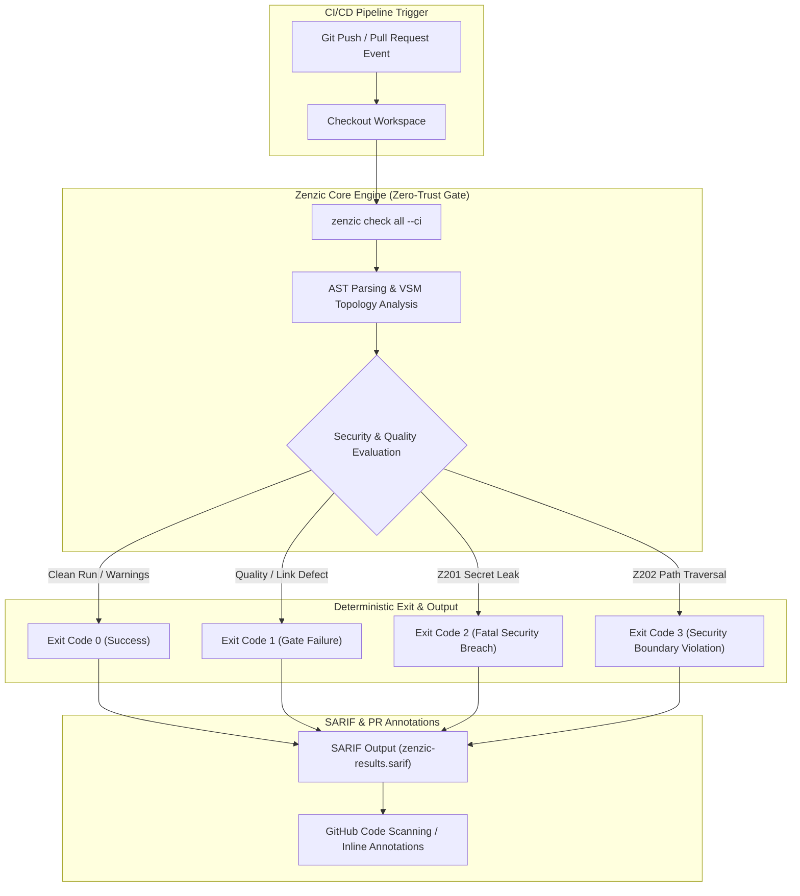

<!-- SPDX-FileCopyrightText: 2026 PythonWoods <dev@pythonwoods.dev> -->
<!-- SPDX-License-Identifier: Apache-2.0 -->

# Zero-Trust CI/CD Quality Gate & SARIF Integration

Documentation drift is silent until a customer encounters a broken link in production or an unredacted API token reaches a public repository. Traditional CI linters attempt to catch syntax flaws, but fail to enforce structural contracts or prevent secret leaks before merge.

Zenzic provides a **Zero-Trust CI/CD Quality Gate**. The core engine evaluates your documentation repository, computes a deterministic Document Quality Score (DQS), and emits native SARIF (Static Analysis Results Interchange Format) output directly into GitHub Code Scanning and CI pipelines.

---

## CI/CD Pipeline Architecture

The following diagram illustrates how the Zenzic Core engine executes natively inside CI pipelines, producing machine-readable SARIF output and enforcing the strict Exit Code Contract:



---

## Exit Code Contract (ADR-075)

Zenzic enforces a non-negotiable exit code contract across all operating systems, CI runners, and output formats (`text`, `json`, `sarif`):

!!! danger "Exit Code Contract (ADR-075)"
    - **`Exit 0` — Success**: All statically-detectable links, anchors, references, and structural rules passed (or warnings suppressed within budget).
    - **`Exit 1` — Quality Gate Failure**: Hard errors detected (broken links `Z101`, orphan pages `Z402`, placeholder text `Z501`) or `suppression_cap` exceeded.
    - **`Exit 2` — Fatal Credential Scanner Breach**: Hardcoded API keys, tokens, or private secrets detected (`Z201`). Non-suppressible.
    - **`Exit 3` — Security Boundary Violation**: Path traversal attempt (`Z202/Z203`) or forbidden scheme detected. Non-suppressible.

---

## Workflow Integration Examples {#github-actions-zenzic-credential-gate}

=== "GitHub Action Wrapper (Recommended)"

    The official [`PythonWoods/zenzic-action`](https://github.com/PythonWoods/zenzic-action) provides zero-config integration with automatic SARIF upload:

    ```yaml title=".github/workflows/zenzic.yml"
    name: Zenzic Documentation Quality Gate

    on:
      push:
        branches: [main]
      pull_request:
        branches: [main]

    jobs:
      zenzic-gate:
        runs-on: ubuntu-latest
        permissions:
          contents: read
          security-events: write
        steps:
          - uses: actions/checkout@v6

          - name: Execute Zenzic Quality Gate
            uses: PythonWoods/zenzic-action@v2
            with:
              version: "0.25.0"
              format: sarif
              upload-sarif: "true"
              fail-on-error: "true"
    ```

=== "uvx (Zero Installation Pipeline)"

    Run Zenzic ephemerally without installing Python or build dependencies on the CI runner:

    ```yaml title=".github/workflows/zenzic-uvx.yml"
    name: Ephemeral Documentation Check

    on:
      pull_request:

    jobs:
      zenzic:
        runs-on: ubuntu-latest
        steps:
          - uses: actions/checkout@v6

          - name: Audit Documentation Graph
            run: uvx zenzic check all --ci
    ```

=== "GitLab CI Pipeline"

    Integrate Zenzic into GitLab CI using `uvx`:

    ```yaml title=".gitlab-ci.yml"
    stages:
      - test

    zenzic_quality_gate:
      stage: test
      image: ghcr.io/astral-sh/uv:latest
      script:
        - uvx zenzic check all --ci --format json --save zenzic-report.json
      artifacts:
        reports:
          codequality: zenzic-report.json
    ```

---

## Machine-Readable Formats (JSON & SARIF)

Zenzic generates machine-readable output for programmatic consumption:

```bash title="Terminal"
# Generate SARIF report for GitHub Code Scanning
zenzic check all --format sarif --save zenzic-results.sarif

# Generate JSON report for custom dashboard ingestion
zenzic check all --format json --save zenzic-results.json
```

---

## Diff & Scoring Protocols {#diff-protocol}

Zenzic provides differential auditing capabilities (`zenzic diff`) to evaluate documentation changes between git commits or baseline score snapshots:

```bash title="Terminal"
# Compare current score against stored baseline
zenzic diff --base .zenzic-score.json
```

### Document-to-Code Parity {#doc-code-parity}

Continuous integration pipelines enforce 100% parity between documentation state and source code definitions.

## See Also

- [CLI Reference](../reference/cli.md)
