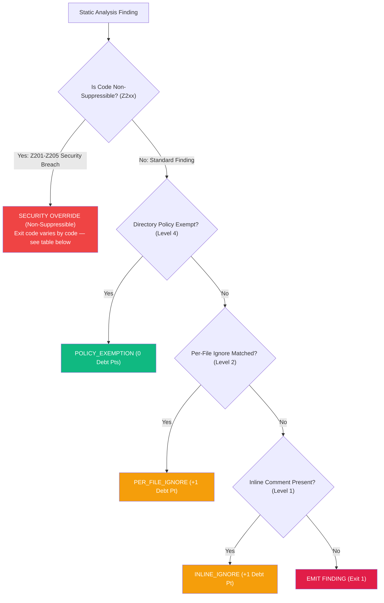

<!-- SPDX-FileCopyrightText: 2026 PythonWoods <dev@pythonwoods.dev> -->
<!-- SPDX-License-Identifier: Apache-2.0 -->

# Suppression Policy & Managed Technical Debt

Uncontrolled suppressions mask architectural decay. When engineering teams treat ignore comments as a quick workaround, documentation quality degrades silently until broken links and security breaches reach production.

Zenzic replaces unmonitored ignore tags with a **Managed Technical Debt Governance Framework**. In Zenzic, a suppression is not an escape hatch — it is an explicit assumption of architectural responsibility. Every suppression is audited, costs Quality Score points, and is bounded by a strict **Suppression CAP**.

---

## Technical Debt Taxonomy

<div class="grid cards" markdown>

- :material-shield-check:{ .lg .middle } **Managed Technical Debt (Clean/Bounded)**

    ---

  - Explicitly declared exceptions with audit trails
  - Bounded by the strict `suppression_cap` ceiling
  - Emits `[MANAGED DEBT]` audit status in CLI & CI
  - Deducts Quality Score points to reflect true visibility

- :material-alert-decagram:{ .lg .middle } **Uncontrolled Architectural Drift**

    ---

  - Unmonitored ignore tags scattered across codebases
  - Hidden security vulnerabilities (credentials, path traversals)
  - Zero audit trails or visibility into debt growth
  - Causes silent PR breakages and customer-facing 404s

</div>

---

## Suppression Evaluation Cascade

The following diagram illustrates how Zenzic evaluates file finding codes against directory policies, per-file ignores, inline comments, and the **Inviolable Security Override**:



### Inspecting a suppression in your editor

Reading this cascade tells you what *should* happen. To see what actually happened for a
specific comment, hover it. Any editor connected to the Zenzic language server — see
[Editor Integrations](../how-to/editor-integrations.md) — shows, on hovering a
`<!-- zenzic:ignore: CODE -->` directive, which branch above it took:

| Hover says | Meaning |
| :--- | :--- |
| ✅ **Active** | The directive suppresses a real finding on that line. |
| ⚠️ **Nothing to suppress** | No such finding occurs there. Reported as [`Z603`](../rules/Z603.md); remove the comment. |
| ↩️ **Redundant** | A `directory_policies` pattern already covers this code for this file. The hover names the matching glob. Also `Z603`. |
| 🔒 **Has no effect** | A `Z2xx` security code. Inviolable — see [Suppressible vs. Inviolable](#suppressible-vs-inviolable-security-surface). |
| ⚙️ **Has no effect (ADR-093)** | A graph- or file-level code, governable only through `.zenzic.toml`. |

Hovering a *live* finding additionally states whether an inline comment could silence it
at all, so the two inviolable families are visible before you reach for a directive that
would only become dead weight.

The hover never changes anything it reports on. It reads the suppression state through a
side-effect-free query, so inspecting a directive cannot consume it or alter the `Z603`
findings for the file.

---

## Four Suppression Governance Levels

Zenzic provides four distinct suppression levels designed for specific architectural contexts:

<div class="grid cards" markdown>

- :material-code-tags:{ .lg .middle } **Level 1: Inline Comment**

    ---

    `<!-- zenzic:ignore: ZXXX -->` placed at the end of a line. Silences a finding on a single line.

    **Cost**: `1 Debt Point`

- :material-file-document-outline:{ .lg .middle } **Level 2: Per-File Ignore**

    ---

    `[governance.per_file_ignores]` in `.zenzic.toml`. Silences a specific rule across a file glob.

    **Cost**: `1 Debt Point per entry`

- :material-folder-remove-outline:{ .lg .middle } **Level 3: Exclusion Zone**

    ---

    `excluded_dirs` or `excluded_file_patterns` in `.zenzic.toml`. Removes directories from evaluation.

    **Cost**: `0 Debt Points` (Not audited)

- :material-shield-home-outline:{ .lg .middle } **Level 4: Directory Policy**

    ---

    `[governance.directory_policies]` in `.zenzic.toml`. Strategic organizational exemptions for legacy doc trees.

    **Cost**: `0 Debt Points` (`[POLICY_EXEMPTION]`)

</div>

---

## Suppressible vs. Inviolable Security Surface

Zenzic enforces a strict boundary between suppressible quality checks and **inviolable security requirements**:

| Rule Category | Codes | Description | Suppressible? | Execution Impact |
| :--- | :--- | :--- | :---: | :--- |
| **Link Integrity** | `Z101`–`Z124` | Broken links, missing anchors, orphan links | ✅ Yes | Deducts score / Exit 1 |
| **Reference Graph** | `Z301`–`Z303` | Dangling reference definitions | ✅ Yes | Deducts score / Exit 1 |
| **Graph Topology** | `Z401`–`Z406` | Missing directory indexes, orphan pages | ✅ Yes | Deducts score / Exit 1 |
| **Content Quality** | `Z501`–`Z506` | Placeholder text, untagged code blocks | ✅ Yes | Deducts score / Exit 1 |
| **Brand Governance**| `Z601`–`Z603` | Brand obsolescence, dead suppressions | ✅ Yes | Deducts score / Exit 1 |
| **Security Surface** | `Z201` | Credential Scanner (Tokens, API Keys) | ❌ **NEVER** | **Fatal Exit 2** |
| **Security Surface** | `Z202` | Path Traversal Guard (Boundary Violation) | ❌ **NEVER** | Exit 1 (not escalated) |
| **Security Surface** | `Z203` | Path Traversal Guard (Fatal, OS System Directory) | ❌ **NEVER** | **Fatal Exit 3** |

!!! danger "Inviolable Security Surface (Z201–Z205)"
    Security findings (**Z201 Credential Scanner**, **Z202/Z203 Path Traversal Guard**) unconditionally bypass all directory policies, per-file ignores, and inline comments. They are non-suppressible security facts. `Z201`, `Z204`, and `Z205` trigger exit code 2; `Z203` triggers exit code 3. `Z202` stays at plain exit code 1 — non-suppressible but deliberately not escalated to Exit 3 — regardless of any TOML configuration.

---

## Suppression CAP & Technical Debt Ledger

While suppressions (`<!-- zenzic:ignore -->`, `directory_policies`, `per_file_ignores`) are permitted, they are now formally tracked as Technical Debt.

The `zenzic audit` command generates a **Technical Debt Ledger** that exposes all active suppressions, tracks `suppression_cap` consumption, and identifies suppression hotspots across the documentation tree.

```toml title=".zenzic.toml"
[governance]
suppression_cap = 30
suppression_cap_fail_hard = true
```

The same fields also work nested under `[tool.zenzic.governance]` in `pyproject.toml` (Track 2) — see
[Embedded in `pyproject.toml`](./configuration-reference.md#embedded-in-pyprojecttoml).

The CLI and CI pipelines report active debt state in the audit footer and through formal `zenzic audit` reports:

```text title="Terminal"
🔒 Suppression Audit: 2/30 (inline: 2, per-file: 0) [MANAGED DEBT]
```

If active suppressions exceed `suppression_cap`, Zenzic emits `[CAP_EXCEEDED]` and fails the quality gate with **Exit 1**.

---

## Related Specifications

- [Finding Codes Catalog](./finding-codes.md) — Comprehensive reference of all `Zxxx` diagnostic codes.
- [Managing Technical Debt](../how-to/handle-technical-debt.md) — How-to guide for applying directory policies and per-file ignores.
