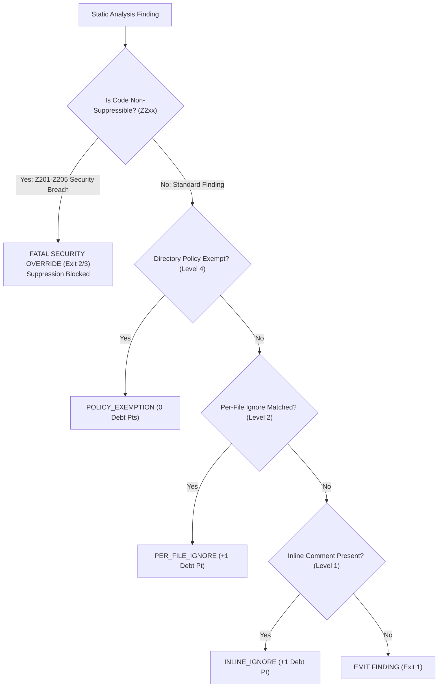

<!-- SPDX-FileCopyrightText: 2026 PythonWoods <dev@pythonwoods.dev> -->
<!-- SPDX-License-Identifier: Apache-2.0 -->

# Suppression Policy & Managed Technical Debt

Uncontrolled suppressions mask architectural decay. When engineering teams treat ignore comments as a quick workaround, documentation quality degrades silently until broken links and security breaches reach production.

Zenzic replaces unmonitored ignore tags with a **Managed Technical Debt Governance Framework**. In Zenzic, a suppression is not an escape hatch — it is an explicit assumption of architectural responsibility. Every suppression is audited, costs Quality Score points, and is bounded by a strict **Suppression CAP**.

---

## Technical Debt Taxonomy

<div class="grid cards" markdown>

- :material-shield-check:{ .lg .middle } **Managed Technical Debt (Clean/Bounded)**

    ---

  - Explicitly declared exceptions with audit trails
  - Bounded by the strict `suppression_cap` ceiling
  - Emits `[MANAGED DEBT]` audit status in CLI & CI
  - Deducts Quality Score points to reflect true visibility

- :material-alert-decagram:{ .lg .middle } **Uncontrolled Architectural Drift**

    ---

  - Unmonitored ignore tags scattered across codebases
  - Hidden security vulnerabilities (credentials, path traversals)
  - Zero audit trails or visibility into debt growth
  - Causes silent PR breakages and customer-facing 404s

</div>

---

## Suppression Evaluation Cascade

The following diagram illustrates how Zenzic evaluates file finding codes against directory policies, per-file ignores, inline comments, and the **Inviolable Security Override**:



---

## Four Suppression Governance Levels

Zenzic provides four distinct suppression levels designed for specific architectural contexts:

`Level 1: Inline Comment`
: `<!-- zenzic:ignore: ZXXX -->` comment placed at the end of a line. Silences a specific finding on a single line. Costs **1 Debt Point**.

`Level 2: Per-File Ignore`
: `[governance.per_file_ignores]` configuration in `.zenzic.toml`. Silences a specific rule across a file glob. Costs **1 Debt Point per entry**.

`Level 3: Exclusion Zone`
: `excluded_dirs` or `excluded_file_patterns` in `.zenzic.toml`. Completely removes non-documentation directories (`build/`, `dist/`) from evaluation. Costs **0 Debt Points** (Not audited).

`Level 4: Directory Policy`
: `[governance.directory_policies]` configuration in `.zenzic.toml`. Strategic organizational exemptions for historical assets (e.g. legacy blog posts). Emits `[POLICY_EXEMPTION]` in audit mode. Costs **0 Debt Points**.

---

## Suppressible vs. Inviolable Security Surface

Zenzic enforces a strict boundary between suppressible quality checks and **inviolable security requirements**:

| Rule Category | Codes | Description | Suppressible? | Execution Impact |
| :--- | :--- | :--- | :---: | :--- |
| **Link Integrity** | `Z101`–`Z124` | Broken links, missing anchors, orphan links | ✅ Yes | Deducts score / Exit 1 |
| **Reference Graph** | `Z301`–`Z303` | Dangling reference definitions | ✅ Yes | Deducts score / Exit 1 |
| **Graph Topology** | `Z401`–`Z406` | Missing directory indexes, orphan pages | ✅ Yes | Deducts score / Exit 1 |
| **Content Quality** | `Z501`–`Z506` | Placeholder text, untagged code blocks | ✅ Yes | Deducts score / Exit 1 |
| **Brand Governance**| `Z601`–`Z603` | Brand obsolescence, dead suppressions | ✅ Yes | Deducts score / Exit 1 |
| **Security Surface**| `Z201` | Credential Scanner (Tokens, API Keys) | ❌ **NEVER** | **Fatal Exit 2** |
| **Security Surface**| `Z202`–`Z203` | Path Traversal Guard (Boundary Violation) | ❌ **NEVER** | **Fatal Exit 3** |

!!! danger "Inviolable Security Surface (Z201–Z205)"
    Security findings (**Z201 Credential Scanner**, **Z202/Z203 Path Traversal Guard**) unconditionally bypass all directory policies, per-file ignores, and inline comments. They are non-suppressible security facts that trigger exit codes 2 and 3 regardless of any TOML configuration.

---

## Suppression CAP & Audit Footer

Zenzic tracks active suppressions against a configured `suppression_cap` (default: **30**).

```toml title=".zenzic.toml"
[governance]
suppression_cap = 30
suppression_cap_fail_hard = true
```

The CLI and CI pipelines report active debt state in the audit footer:

```text title="Terminal"
🔒 Suppression Audit: 2/30 (inline: 2, per-file: 0) [MANAGED DEBT]
```

If active suppressions exceed `suppression_cap`, Zenzic emits `[CAP_EXCEEDED]` and fails the quality gate with **Exit 1**.
